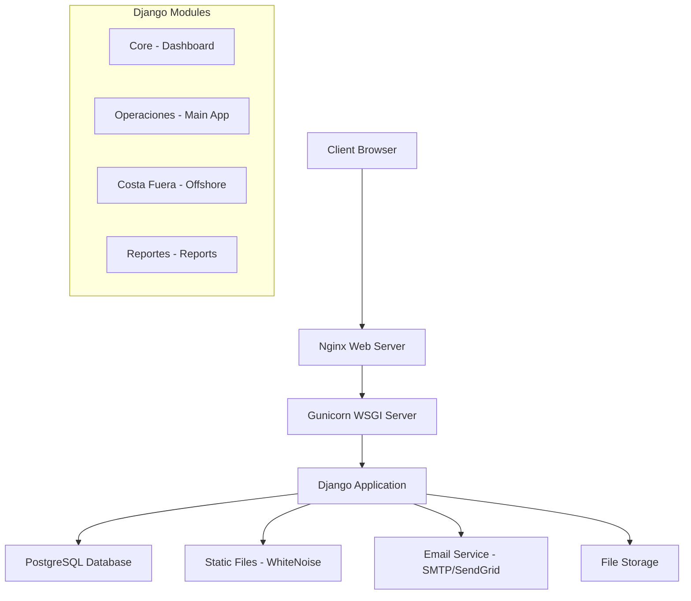
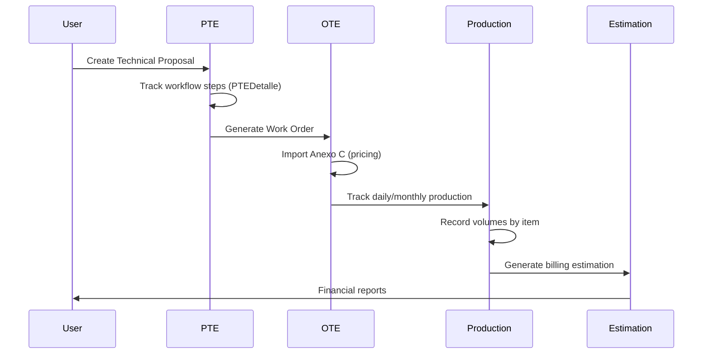

## Overview

SASCOP BME SubTec is built on Django 4.2.7 with a PostgreSQL backend, designed specifically for managing subsea engineering projects from proposal to execution and billing. The system follows a modular architecture with clear separation of concerns.

<Info>
  The system manages the complete lifecycle: **Technical Proposals (PTEs)** → **Work Orders (OTEs)** → **Production Tracking** → **Financial Estimations**
</Info>

## High-Level Architecture



## Project Structure

The Django project is organized into multiple applications:

<Tabs>
  <Tab title="Project Root">
    ```
    bme_subtec/
    ├── bme_subtec/              # Project settings
    │   ├── settings.py          # Configuration
    │   ├── urls.py              # Root URL routing
    │   └── wsgi.py              # WSGI entry point
    ├── core/                    # Dashboard module
    ├── operaciones/             # Main operations module
    ├── costa_fuera/             # Offshore operations
    ├── reportes/                # Reporting module
    ├── manage.py                # Django management
    ├── requirements.txt         # Dependencies
    └── .env                     # Environment config
    ```
  </Tab>
  
  <Tab title="Operaciones App">
    ```
    operaciones/
    ├── models/
    │   ├── pte_models.py        # PTE entities
    │   ├── ote_models.py        # OTE entities
    │   ├── catalogos_models.py  # Master catalogs
    │   ├── produccion_models.py # Production tracking
    │   └── registro_actividad_models.py
    ├── views/
    │   ├── login.py             # Authentication
    │   ├── pte.py               # PTE operations
    │   ├── ote.py               # OTE operations
    │   ├── produccion.py        # Production
    │   ├── catalogos.py         # Catalog management
    │   ├── centro_consulta.py   # BI & Analytics
    │   └── api.py               # REST endpoints
    ├── middleware.py            # Custom middleware
    ├── urls.py                  # URL routing
    ├── static/                  # CSS, JS, images
    └── templates/               # HTML templates
    ```
  </Tab>
  
  <Tab title="URL Structure">
    From `operaciones/urls.py:1`:
    
    ```python
    urlpatterns = [
        # Authentication
        path('accounts/login/', login.custom_login, name='login'),
        
        # PTEs
        path('pte/', pte.lista_pte, name='lista_pte'),
        path('pte/<int:pte_id>/', pte.detalle_pte, name='detalle_pte'),
        
        # OTEs
        path('ot/', ote.lista_ote, name='lista_ot'),
        path('ot/crear-ot-reprogramacion/', ote.crear_ot, name='crear_ot'),
        
        # Production
        path('produccion/', produccion.lista_produccion, name='lista_produccion'),
        
        # Catalogs
        path('catalogos/producto/', catalogos.lista_producto, name='lista_producto'),
        
        # BI & Analytics
        path('centro_consulta/centro-consulta/', centro_consulta.fn_centro_consulta),
        
        # API Endpoints
        path('api/estadisticas/', api.api_estadisticas, name='api_estadisticas'),
    ]
    ```
  </Tab>
</Tabs>

## Core Data Models

The system uses a sophisticated relational model with several key entities:

### 1. PTE (Technical Project Proposal) Module

<Accordion title="PTEHeader Model">
  The main entity for technical project proposals:

  ```python operaciones/models/pte_models.py:19-49
  class PTEHeader(models.Model):
      ESTATUS_CHOICES = [
          (1, 'Activo'),
          (2, 'En Proceso'),
          (3, 'Terminado'),
          (4, 'Cancelado'),
      ]
      
      id_tipo = models.ForeignKey(Tipo, on_delete=models.CASCADE, 
                                   limit_choices_to={'nivel_afectacion': 1})
      oficio_pte = models.CharField(max_length=100)
      oficio_solicitud = models.CharField(max_length=100)
      descripcion_trabajo = models.TextField()
      fecha_solicitud = models.DateField(blank=True, null=True)
      fecha_entrega = models.DateField(blank=True, null=True)
      plazo_dias = models.FloatField()
      id_orden_trabajo = models.CharField(max_length=100, blank=True, null=True)
      id_responsable_proyecto = models.ForeignKey(ResponsableProyecto, on_delete=models.CASCADE)
      total_homologado = models.DecimalField(max_digits=15, decimal_places=2, default=0)
      estatus = models.IntegerField(choices=ESTATUS_CHOICES, default=1)
      prioridad = models.IntegerField(blank=True, null=True)
      id_cliente = models.ForeignKey(Cliente, on_delete=models.CASCADE)
      comentario = models.TextField(blank=True, null=True)

      class Meta:
          db_table = 'pte_header'
          permissions = [
              ("view_centro_consulta", "Puede visualizar el centro de consulta"),
          ]
  ```

  **Key Fields:**
  - `oficio_pte`: Official PTE document number
  - `descripcion_trabajo`: Detailed work description
  - `plazo_dias`: Duration in days
  - `estatus`: Current status (Active, In Process, Finished, Cancelled)
  - `id_tipo`: Type classification with nivel_afectacion=1
</Accordion>

<Accordion title="PTEDetalle Model">
  Tracks workflow steps for each PTE:

  ```python operaciones/models/pte_models.py:51-66
  class PTEDetalle(models.Model):
      id_pte_header = models.ForeignKey(PTEHeader, on_delete=models.CASCADE, 
                                        related_name='detalles')
      estatus_paso = models.ForeignKey(Estatus, on_delete=models.CASCADE, 
                                       limit_choices_to={'nivel_afectacion': 4})
      id_paso = models.ForeignKey(Paso, on_delete=models.CASCADE)
      fecha_entrega = models.DateField(null=True, blank=True)
      fecha_inicio = models.DateField(null=True, blank=True)
      fecha_termino = models.DateField(null=True, blank=True)
      comentario = models.TextField(blank=True, null=True)
      archivo = models.TextField(blank=True, null=True)

      class Meta:
          db_table = 'pte_detalle'
          ordering = ['id_paso__orden']
  ```

  **Purpose:** Each PTE has multiple steps (pasos), each tracked with dates and status.
</Accordion>

<Accordion title="Paso Model">
  Defines workflow steps:

  ```python operaciones/models/pte_models.py:4-17
  class Paso(models.Model):
      descripcion = models.CharField(max_length=200)
      orden = models.CharField(blank=True, null=True, max_length=10)
      activo = models.BooleanField(default=True)
      importancia = models.FloatField(default=0)
      tipo = models.IntegerField(blank=True, null=True, default=1)
      comentario = models.TextField(blank=True, null=True)
      id_tipo_cliente = models.ForeignKey(Tipo, on_delete=models.CASCADE)
      
      class Meta:
          db_table = 'paso'
          ordering = ['orden']

      def __str__(self):
          return f"{self.orden}. {self.descripcion}"
  ```

  **Examples:** Engineering review, client approval, technical analysis, budget preparation
</Accordion>

### 2. OTE (Work Order) Module

<Accordion title="OTE Model">
  Main work order entity with comprehensive tracking:

  ```python operaciones/models/ote_models.py:5-93
  class OTE(models.Model): 
      id_tipo = models.ForeignKey(Tipo, on_delete=models.CASCADE, 
                                  limit_choices_to={'nivel_afectacion': 2})
      id_pte_header = models.ForeignKey(PTEHeader, on_delete=models.CASCADE, 
                                         null=True, blank=True)
      orden_trabajo = models.CharField(max_length=100)
      descripcion_trabajo = models.TextField()
      id_responsable_proyecto = models.ForeignKey(ResponsableProyecto, on_delete=models.CASCADE)
      responsable_cliente = models.CharField(max_length=200)
      oficio_ot = models.CharField(max_length=100)
      id_estatus_ot = models.ForeignKey(Estatus, on_delete=models.CASCADE, 
                                         limit_choices_to={'nivel_afectacion': 2})
      fecha_inicio_programado = models.DateField(blank=True, null=True)
      fecha_inicio_real = models.DateField(blank=True, null=True)
      fecha_termino_programado = models.DateField(blank=True, null=True)
      fecha_termino_real = models.DateField(blank=True, null=True)
      estatus = models.IntegerField(default=1)
      num_reprogramacion = models.IntegerField(null=True, blank=True)
      ot_principal = models.IntegerField(null=True, blank=True)
      monto_mxn = models.DecimalField(decimal_places=2, max_digits=25, default=0)
      monto_usd = models.DecimalField(decimal_places=2, max_digits=25, default=0)
      id_frente = models.ForeignKey(Frente, on_delete=models.SET_NULL, null=True)
      id_embarcacion = models.IntegerField(null=True, blank=True)
      id_plataforma = models.IntegerField(null=True, blank=True)
      id_intercom = models.IntegerField(null=True, blank=True)
      id_patio = models.IntegerField(null=True, blank=True)
      plazo_dias = models.IntegerField(null=True, blank=True)
      id_cliente = models.ForeignKey(Cliente, on_delete=models.CASCADE)

      # Patio phase tracking
      requiere_patio = models.BooleanField(default=False, 
                                           verbose_name="Requiere Fase en Patio")
      fecha_inicio_patio = models.DateField(blank=True, null=True)
      fecha_fin_patio = models.DateField(blank=True, null=True)
      
      class Meta:
          db_table = 'ot'

      @property
      def tiene_reprogramaciones(self):
          """Retorna True si esta OT tiene reprogramaciones asociadas"""
          if self.id_tipo_id != 4:  # Solo para OTs iniciales
              return False
          
          return OTE.objects.filter(
              ot_principal=self.id,
              id_tipo_id=5,
              estatus__in=[-1, 1]
          ).exists()
  ```

  **Key Features:**
  - Links to parent PTE via `id_pte_header`
  - Tracks multiple sites: embarcacion, plataforma, intercom, patio
  - Supports rescheduling via `ot_principal` and `num_reprogramacion`
  - Dual currency tracking (MXN and USD)
  - Patio phase management for yard work
</Accordion>

<Accordion title="OTDetalle Model">
  Workflow step tracking for OTEs:

  ```python operaciones/models/ote_models.py:111-126
  class OTDetalle(models.Model):
      id_ot = models.ForeignKey(OTE, on_delete=models.CASCADE, 
                                related_name='detalles')
      estatus_paso = models.ForeignKey(Estatus, on_delete=models.CASCADE, 
                                       limit_choices_to={'nivel_afectacion': 4})
      id_paso = models.ForeignKey(PasoOt, on_delete=models.CASCADE)
      fecha_entrega = models.DateField(null=True, blank=True)
      fecha_inicio = models.DateField(null=True, blank=True)
      fecha_termino = models.DateField(null=True, blank=True)
      comentario = models.TextField(blank=True, null=True)
      archivo = models.TextField(blank=True, null=True)

      class Meta:
          db_table = 'ot_detalle'
          ordering = ['id_paso__id']
  ```

  Similar to PTEDetalle but for work orders.
</Accordion>

<Accordion title="ImportacionAnexo & PartidaAnexoImportada Models">
  Handles contract annex imports (pricing schedules):

  ```python operaciones/models/ote_models.py:135-172
  class ImportacionAnexo(models.Model):
      """Header de la importación de anexo C."""
      ot = models.ForeignKey(OTE, on_delete=models.CASCADE, 
                             related_name='importaciones_anexo')
      archivo_excel = models.FileField(upload_to=generar_ruta_anexo)
      fecha_carga = models.DateTimeField(auto_now_add=True)
      usuario_carga = models.ForeignKey('auth.User', on_delete=models.SET_NULL, null=True)
      total_registros = models.IntegerField(default=0)
      es_activo = models.BooleanField(default=True)

      class Meta:
          db_table = 'importacion_anexo'

  class PartidaAnexoImportada(models.Model):
      """Detalle de la importación de anexo C."""
      importacion_anexo = models.ForeignKey(ImportacionAnexo, on_delete=models.CASCADE, 
                                            related_name='partidas')
      id_partida = models.CharField(max_length=10)
      descripcion_concepto = models.TextField()
      anexo = models.CharField(max_length=10, null=True, blank=True)
      unidad_medida = models.ForeignKey(UnidadMedida, on_delete=models.CASCADE)
      volumen_proyectado = models.DecimalField(max_digits=18, decimal_places=6)
      precio_unitario_mn = models.DecimalField(max_digits=15, decimal_places=4)
      precio_unitario_usd = models.DecimalField(max_digits=15, decimal_places=4)
      orden_fila = models.IntegerField()
      
      class Meta:
          db_table = 'partida_anexo_importada'
  ```

  **Purpose:** Import contract pricing from Excel files (Anexo C) with unit prices and projected volumes.
</Accordion>

### 3. Production Tracking Module

<Accordion title="Production Models Hierarchy">
  The production tracking uses a three-level hierarchy:

  ```python operaciones/models/produccion_models.py:22-88
  class ReporteMensual(models.Model):
      """Representa la 'Carpeta Mensual' de una OT."""
      id_ot = models.ForeignKey(OTE, on_delete=models.CASCADE, 
                                related_name='reportes_mensuales')
      mes = models.IntegerField(help_text="Mes numérico (1-12)")
      anio = models.IntegerField(help_text="Año (Ej. 2025)")
      archivo = models.URLField(blank=True, null=True, 
                                verbose_name="Link Evidencia (Drive)")
      id_estatus = models.ForeignKey(Estatus, on_delete=models.CASCADE, 
                                      limit_choices_to={'nivel_afectacion': 5})

      class Meta:
          db_table = 'reporte_mensual_header'
          unique_together = ['id_ot', 'mes', 'anio']

  class ReporteDiario(models.Model):
      """Controla el estatus operativo del día para una OT."""
      id_reporte_mensual = models.ForeignKey(ReporteMensual, on_delete=models.CASCADE, 
                                             related_name='dias_estatus')
      fecha = models.DateField()
      id_estatus = models.ForeignKey(Estatus, on_delete=models.CASCADE, 
                                      limit_choices_to={'nivel_afectacion': 6})
      comentario = models.CharField(max_length=255, blank=True, null=True)
      bloqueado = models.BooleanField(default=False)
      id_sitio = models.ForeignKey(Sitio, on_delete=models.CASCADE)
      
      class Meta:
          db_table = 'reporte_diario_detalle'
          unique_together = ['id_reporte_mensual', 'fecha', 'id_sitio']

  class Produccion(models.Model):
      TIPO_TIEMPO_CHOICES = [
          ('TE', 'Tiempo Efectivo'),
          ('CMA', 'Costo Mínimo Aplicado'),
      ]
      id_partida_anexo = models.ForeignKey(PartidaAnexoImportada, 
                                           on_delete=models.PROTECT, 
                                           related_name='registros_produccion')
      id_reporte_mensual = models.ForeignKey(ReporteMensual, on_delete=models.CASCADE, 
                                             related_name='producciones')
      fecha_produccion = models.DateField()
      volumen_produccion = models.DecimalField(max_digits=15, decimal_places=6)
      tipo_tiempo = models.CharField(max_length=3, choices=TIPO_TIEMPO_CHOICES)
      es_excedente = models.BooleanField(default=False)
      id_estatus_cobro = models.ForeignKey(Estatus, on_delete=models.CASCADE, 
                                           limit_choices_to={'nivel_afectacion': 3})
      id_sitio_produccion = models.ForeignKey(Sitio, on_delete=models.SET_NULL, null=True)

      class Meta:
          db_table = 'produccion'
          unique_together = ['id_partida_anexo', 'fecha_produccion', 
                             'tipo_tiempo', 'id_sitio_produccion']
  ```

  **Hierarchy:**
  1. **ReporteMensual**: Monthly folder for an OT
  2. **ReporteDiario**: Daily operational status
  3. **Produccion**: Actual production volumes by item/date
</Accordion>

<Accordion title="RegistroGPU Model">
  Administrative tracking and evidence for billable production:

  ```python operaciones/models/produccion_models.py:90-104
  class RegistroGPU(models.Model):
      """Espejo Administrativo y Evidencias. Solo se crea para C-2 y C-3."""
      id_produccion = models.OneToOneField(Produccion, on_delete=models.CASCADE, 
                                           related_name='gpu')
      id_estatus = models.ForeignKey(Estatus, on_delete=models.CASCADE, 
                                      limit_choices_to={'nivel_afectacion': 6})
      archivo = models.URLField(max_length=500, blank=True, null=True, 
                                verbose_name="Link Evidencia Fotográfica")
      nota_bloqueo = models.TextField(blank=True, verbose_name="Observaciones")
      id_estimacion_detalle = models.ForeignKey('EstimacionDetalle', 
                                                on_delete=models.SET_NULL, null=True)
      fecha_actualizacion = models.DateTimeField(auto_now=True)

      class Meta:
          db_table = 'registro_generadores_pu'
  ```

  **Purpose:** GPU (Price Unit Generator) records link production to billing with photo evidence.
</Accordion>

### 4. Financial Estimation Module

<Accordion title="Estimation Models">
  Handles billing and financial estimations:

  ```python operaciones/models/produccion_models.py:106-135
  class EstimacionHeader(models.Model):
      id_ot = models.ForeignKey(OTE, on_delete=models.CASCADE)
      fecha_estimacion = models.DateField()
      fecha_desde = models.DateField()
      fecha_hasta = models.DateField()
      id_estatus_cobro = models.ForeignKey(Estatus, on_delete=models.CASCADE, 
                                           limit_choices_to={'nivel_afectacion': 3})
      total_volumen_producido = models.DecimalField(max_digits=15, decimal_places=2, default=0)
      total_volumen_estimado = models.DecimalField(max_digits=15, decimal_places=2, default=0)
      total_importe_mn = models.DecimalField(max_digits=15, decimal_places=2, default=0)
      total_importe_usd = models.DecimalField(max_digits=15, decimal_places=2, default=0)
      comentario = models.TextField(blank=True)

      class Meta:
          db_table = 'estimacion_header'

  class EstimacionDetalle(models.Model):
      id_estimacion_header = models.ForeignKey(EstimacionHeader, on_delete=models.CASCADE, 
                                               related_name='detalles')
      id_produccion = models.ForeignKey(Produccion, on_delete=models.CASCADE)
      volumen_actual = models.DecimalField(max_digits=15, decimal_places=2)
      volumen_estimado = models.DecimalField(max_digits=15, decimal_places=2, default=0)
      id_estatus_cobro = models.ForeignKey(Estatus, on_delete=models.CASCADE, 
                                           limit_choices_to={'nivel_afectacion': 3})
      comentario_ajuste = models.TextField(blank=True)
      
      class Meta:
          db_table = 'estimacion_detalle'
  ```

  **Purpose:** Create periodic estimations (invoices) based on production data.
</Accordion>

### 5. Master Catalogs

<Accordion title="Core Catalog Models">
  ```python operaciones/models/catalogos_models.py:2-93
  class Tipo(models.Model):
      """Classification types with affectation levels"""
      TIPO_CHOICES = [
          ('1', 'PTE'),
          ('2', 'OT'),
          ('3', 'PARTIDA'),
          ('4', 'PRODUCCION')
      ]
      descripcion = models.CharField(max_length=200)
      nivel_afectacion = models.IntegerField(choices=TIPO_CHOICES, default=0)
      activo = models.BooleanField(default=True)

  class Frente(models.Model):
      """Work fronts or zones"""
      descripcion = models.CharField(max_length=200)
      nivel_afectacion = models.IntegerField(blank=True, null=True)
      activo = models.BooleanField(default=True)

  class Estatus(models.Model):
      """Status codes for different entity types"""
      TIPO_AFECTACION = [
          ('1', 'PTE'),
          ('2', 'OT'),
          ('3', 'COBRO'),
          ('4', 'PASOS PTE'),
      ]
      descripcion = models.CharField(max_length=100)
      nivel_afectacion = models.IntegerField(choices=TIPO_AFECTACION, default=0)
      activo = models.BooleanField(default=True)

  class Sitio(models.Model):
      """Work sites (platforms, vessels, yards)"""
      descripcion = models.CharField(max_length=100)
      activo = models.BooleanField(default=True)
      id_frente = models.ForeignKey(Frente, on_delete=models.CASCADE)

  class UnidadMedida(models.Model):
      """Units of measurement"""
      descripcion = models.CharField(max_length=50)
      clave = models.CharField(max_length=10)
      activo = models.BooleanField(default=True)

  class ResponsableProyecto(models.Model):
      """Project managers"""
      descripcion = models.CharField(max_length=50)
      activo = models.BooleanField(default=True)

  class Cliente(models.Model):
      """Clients"""
      descripcion = models.CharField(max_length=100)
      id_tipo = models.ForeignKey(Tipo, on_delete=models.CASCADE)
      activo = models.BooleanField(default=True)
  ```
</Accordion>

<Accordion title="Contract Management Models">
  ```python operaciones/models/catalogos_models.py:133-221
  class Contrato(models.Model):
      numero_contrato = models.CharField(max_length=100, unique=True)
      descripcion = models.TextField()
      cliente = models.ForeignKey(Cliente, on_delete=models.PROTECT)
      fecha_inicio = models.DateField()
      fecha_termino = models.DateField()
      monto_mn = models.DecimalField(max_digits=20, decimal_places=2, default=0)
      monto_usd = models.DecimalField(max_digits=20, decimal_places=2, default=0)
      activo = models.BooleanField(default=True)

  class AnexoContrato(models.Model):
      """Contract annexes (technical, financial, legal)"""
      TIPO_ANEXO = [
          ('TECNICO', 'Anexo Técnico (Especificaciones)'),
          ('FINANCIERO', 'Anexo C (Lista de Precios)'),
          ('LEGAL', 'Legal/Administrativo'),
      ]
      contrato = models.ForeignKey(Contrato, on_delete=models.CASCADE, 
                                   related_name='anexos_maestros')
      clave = models.CharField(max_length=100)
      descripcion = models.CharField(max_length=100)
      tipo = models.CharField(max_length=20, choices=TIPO_ANEXO, default='FINANCIERO')
      archivo = models.FileField(upload_to='contratos/anexos_maestros/')
      monto_mn = models.DecimalField(max_digits=20, decimal_places=2, default=0)
      monto_usd = models.DecimalField(max_digits=20, decimal_places=2, default=0)

  class SubAnexo(models.Model):
      """Sub-sections of annexes"""
      anexo_maestro = models.ForeignKey(AnexoContrato, on_delete=models.CASCADE, 
                                        related_name='sub_anexos')
      clave_anexo = models.CharField(max_length=50)
      descripcion = models.TextField()
      unidad_medida = models.ForeignKey(UnidadMedida, on_delete=models.CASCADE)
      cantidad = models.DecimalField(max_digits=20, decimal_places=2, default=0)
      precio_unitario_mn = models.DecimalField(max_digits=20, decimal_places=2, default=0)
      precio_unitario_usd = models.DecimalField(max_digits=20, decimal_places=2, default=0)

  class ConceptoMaestro(models.Model):
      """Master concept catalog (pricing items)"""
      sub_anexo = models.ForeignKey(SubAnexo, on_delete=models.CASCADE, 
                                    related_name='conceptos')
      partida_ordinaria = models.CharField(max_length=50)  # Regular items
      partida_extraordinaria = models.CharField(max_length=50)  # PUE items
      codigo_interno = models.CharField(max_length=50)
      descripcion = models.TextField()
      unidad_medida = models.ForeignKey(UnidadMedida, on_delete=models.PROTECT)
      cantidad = models.DecimalField(max_digits=20, decimal_places=2, default=0)
      precio_unitario_mn = models.DecimalField(max_digits=18, decimal_places=2, default=0)
      precio_unitario_usd = models.DecimalField(max_digits=18, decimal_places=2, default=0)
      id_tipo_partida = models.ForeignKey(Tipo, on_delete=models.CASCADE, 
                                          limit_choices_to={'nivel_afectacion': 3})
      
      # PUE tracking
      pte_creacion = models.CharField(max_length=100)
      ot_creacion = models.CharField(max_length=100)
      fecha_autorizacion = models.DateField()
      estatus = models.CharField(max_length=20)
  ```

  **Purpose:** Manage contracts with pricing catalogs, supporting both regular items and PUEs (Precio Unitario Extraordinario).
</Accordion>

### 6. Schedule Management

<Accordion title="Cronograma (MS Project Import) Models">
  ```python operaciones/models/produccion_models.py:165-233
  class CronogramaVersion(models.Model):
      """La 'foto' del archivo .mpp importado."""
      id_ot = models.ForeignKey(OTE, on_delete=models.CASCADE, 
                                related_name='cronogramas')
      nombre_version = models.CharField(max_length=150)
      archivo_mpp = models.FileField(upload_to='operaciones/mpps/')
      fecha_carga = models.DateTimeField(auto_now_add=True)
      es_activo = models.BooleanField(default=True)
      fecha_inicio_proyecto = models.DateField(null=True, blank=True)
      fecha_fin_proyecto = models.DateField(null=True, blank=True)

  class TareaCronograma(models.Model):
      """Desglose de tareas del Project."""
      version = models.ForeignKey(CronogramaVersion, on_delete=models.CASCADE, 
                                  related_name='tareas')
      uid_project = models.IntegerField()  # Unique ID from MS Project
      id_project = models.IntegerField()   # Task ID from MS Project
      wbs = models.CharField(max_length=50)  # Work Breakdown Structure code
      nombre = models.CharField(max_length=500)
      nivel_esquema = models.IntegerField(default=0)  # Indentation level
      es_resumen = models.BooleanField(default=False)  # Summary task flag
      padre_uid = models.IntegerField(null=True, blank=True)
      fecha_inicio = models.DateField(null=True)
      fecha_fin = models.DateField(null=True)
      duracion_dias = models.DecimalField(max_digits=10, decimal_places=2, default=0)
      porcentaje_mpp = models.DecimalField(max_digits=5, decimal_places=2, default=0)
      porcentaje_completado = models.DecimalField(max_digits=5, decimal_places=2, default=0)
      recursos = models.TextField(blank=True, default='')

  class AvanceCronograma(models.Model):
      """La doble verdad: Real vs Cliente."""
      tarea = models.OneToOneField(TareaCronograma, on_delete=models.CASCADE, 
                                   related_name='avance')
      porcentaje_real = models.DecimalField(max_digits=5, decimal_places=2, default=0)
      porcentaje_cliente = models.DecimalField(max_digits=5, decimal_places=2, default=0)
      comentario = models.TextField(blank=True)
      fecha_actualizacion = models.DateTimeField(auto_now=True)

  class DependenciaTarea(models.Model):
      """Relaciones de precedencia entre tareas del cronograma."""
      version = models.ForeignKey(CronogramaVersion, on_delete=models.CASCADE, 
                                  related_name='dependencias')
      tarea_predecesora_uid = models.IntegerField()
      tarea_sucesora_uid = models.IntegerField()
      tipo = models.CharField(max_length=2, default='FS', choices=[
          ('FS', 'Fin a Inicio'),
          ('SS', 'Inicio a Inicio'),
          ('FF', 'Fin a Fin'),
          ('SF', 'Inicio a Fin'),
      ])
      lag_dias = models.DecimalField(max_digits=8, decimal_places=2, default=0)
  ```

  **Purpose:** Import MS Project (.mpp) files and track progress with dual reporting (real vs client).
</Accordion>

## Middleware & Security

### Session Timeout Middleware

```python operaciones/middleware.py:5-20
class SessionTimeoutMiddleware:
    def __init__(self, get_response):
        self.get_response = get_response

    def __call__(self, request):
        if request.user.is_authenticated:
            last_activity = request.session.get('last_activity')
            if last_activity:
                idle_time = timezone.now().timestamp() - last_activity
                if idle_time > settings.SESSION_COOKIE_AGE:
                    request.session.flush()
                    return redirect('operaciones:login?session_expired=1')
            request.session['last_activity'] = timezone.now().timestamp()
        
        response = self.get_response(request)
        return response
```

**Features:**
- Automatic logout after 2 hours of inactivity (configurable)
- Activity tracking per session
- User-friendly session expiry messages

### Authentication

Custom login view supports both username and email:

```python operaciones/views/login.py:11-52
@ensure_csrf_cookie 
def custom_login(request):
    """Vista para login que acepta username o email"""
    if request.user.is_authenticated:
        return redirect('core:dashboard')
    
    if request.method == 'POST':
        username_or_email = request.POST.get('username')
        password = request.POST.get('password')
        
        # Try username first
        user = authenticate(request, username=username_or_email, password=password)
        
        # If failed, try email
        if user is None:
            try:
                user_by_email = User.objects.get(email__iexact=username_or_email)
                user = authenticate(request, username=user_by_email.username, password=password)
            except User.DoesNotExist:
                user = None
        
        if user is not None:
            login(request, user)
            request.session['last_activity'] = timezone.now().timestamp()
            return redirect('core:dashboard')
```

## Data Flow



## Key Design Patterns

<CardGroup cols={2}>
  <Card title="Foreign Key Constraints" icon="link">
    Extensive use of `limit_choices_to` to filter options by `nivel_afectacion`:
    
    ```python
    id_tipo = models.ForeignKey(
        Tipo, 
        limit_choices_to={'nivel_afectacion': 1}
    )
    ```
  </Card>
  
  <Card title="Related Names" icon="diagram-project">
    Clear reverse relationships:
    
    ```python
    id_pte_header = models.ForeignKey(
        PTEHeader,
        related_name='detalles'
    )
    # Access: pte.detalles.all()
    ```
  </Card>
  
  <Card title="Unique Constraints" icon="shield">
    Prevent duplicate records:
    
    ```python
    class Meta:
        unique_together = [
            'id_partida_anexo',
            'fecha_produccion',
            'tipo_tiempo'
        ]
    ```
  </Card>
  
  <Card title="Soft Deletes" icon="trash">
    Most models use `activo` flag instead of deleting:
    
    ```python
    activo = models.BooleanField(default=True)
    ```
  </Card>
</CardGroup>

## Database Indexes

Key indexes for performance:

```python
class Meta:
    indexes = [
        models.Index(fields=['fecha_produccion']),
        models.Index(fields=['id_partida_anexo']),
        models.Index(fields=['tipo_tiempo'])
    ]
```

Applied to high-query tables like `produccion` and `reporte_diario_detalle`.

## Technology Stack

<Tabs>
  <Tab title="Backend">
    - **Framework**: Django 4.2.7
    - **Database**: PostgreSQL 12+ with SSL
    - **ORM**: Django ORM
    - **WSGI Server**: Gunicorn 21.2.0
    - **Static Files**: WhiteNoise 6.4.0
  </Tab>
  
  <Tab title="Data Processing">
    - **Excel**: openpyxl 3.1.5, XlsxWriter 3.1.2
    - **Data Analysis**: pandas 2.3.3, numpy 2.3.3
    - **PDF**: reportlab 4.0.4, PyPDF2 3.0.1
    - **Charts**: matplotlib 3.10.8
    - **QR Codes**: qrcode 7.4.2
  </Tab>
  
  <Tab title="Communications">
    - **Email**: django-anymail 14.0, SMTP
    - **HTTP**: requests 2.31.0
    - **HTML Parsing**: beautifulsoup4 4.12.2
  </Tab>
  
  <Tab title="Configuration">
    - **Environment**: python-dotenv 1.0.0
    - **Timezone**: America/Mexico_City
    - **Language**: Spanish (es-mx)
  </Tab>
</Tabs>

## Performance Considerations

<AccordionGroup>
  <Accordion title="Query Optimization">
    - Use `select_related()` for foreign keys
    - Use `prefetch_related()` for reverse relationships
    - Database indexes on frequently queried fields
    - Unique constraints prevent duplicate queries
  </Accordion>
  
  <Accordion title="Caching Strategy">
    - Static files cached with WhiteNoise
    - Session data in database
    - Consider Redis for high-traffic deployments
  </Accordion>
  
  <Accordion title="File Upload Handling">
    - Excel files processed asynchronously
    - Files stored with dynamic paths
    - Large file support (client_max_body_size: 100M)
  </Accordion>
</AccordionGroup>

## Next Steps

<CardGroup cols={2}>
  <Card title="User Roles" icon="users" href="/concepts/user-roles">
    Learn about permissions and access control
  </Card>
  <Card title="Workflow" icon="diagram-project" href="/concepts/workflow">
    Understand the PTE to OTE workflow
  </Card>
  <Card title="Installation" icon="download" href="/installation">
    Set up your own instance
  </Card>
  <Card title="Quickstart" icon="rocket" href="/quickstart">
    Get started quickly
  </Card>
</CardGroup>
