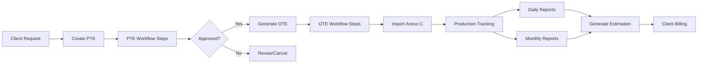

## Overview

SASCOP BME SubTec implements a comprehensive workflow for managing subsea engineering projects from initial proposal through execution and billing. The system tracks each phase with detailed step management, document control, and financial tracking.

<Info>
  **Core Workflow**: Technical Proposal (PTE) → Work Order (OTE) → Production Tracking → Financial Estimation
</Info>

## Workflow Phases



## Phase 1: Technical Proposal (PTE)

### Creating a PTE

<Steps>
  <Step title="Initiate PTE Creation">
    Navigate to PTEs section and click "Crear PTE"

    **Required Information:**
    - Official document number (`oficio_pte`)
    - Request document number (`oficio_solicitud`)
    - Work description (`descripcion_trabajo`)
    - Client (`id_cliente`)
    - Request date (`fecha_solicitud`)
    - Delivery date (`fecha_entrega`)
    - Duration in days (`plazo_dias`)
    - Project type (`id_tipo`)
    - Project manager (`id_responsable_proyecto`)
    - Priority level (`prioridad`)

    <CodeGroup>
      ```python Model Definition
      # From operaciones/models/pte_models.py:19-49
      class PTEHeader(models.Model):
          ESTATUS_CHOICES = [
              (1, 'Activo'),
              (2, 'En Proceso'),
              (3, 'Terminado'),
              (4, 'Cancelado'),
          ]
          
          id_tipo = models.ForeignKey(Tipo, on_delete=models.CASCADE)
          oficio_pte = models.CharField(max_length=100)
          oficio_solicitud = models.CharField(max_length=100)
          descripcion_trabajo = models.TextField()
          fecha_solicitud = models.DateField()
          fecha_entrega = models.DateField()
          plazo_dias = models.FloatField()
          id_responsable_proyecto = models.ForeignKey(ResponsableProyecto, on_delete=models.CASCADE)
          estatus = models.IntegerField(choices=ESTATUS_CHOICES, default=1)
          id_cliente = models.ForeignKey(Cliente, on_delete=models.CASCADE)
          total_homologado = models.DecimalField(max_digits=15, decimal_places=2, default=0)
      ```

      ```python URL Pattern
      # From operaciones/urls.py:21
      path('pte/crear/', pte.crear_pte, name='crear_pte'),
      ```
    </CodeGroup>
  </Step>

  <Step title="Automatic Step Creation">
    Upon PTE creation, the system automatically creates workflow steps based on the client type:

    ```python
    # System creates PTEDetalle records for each Paso
    # Steps are filtered by: Paso.objects.filter(id_tipo_cliente=pte.id_cliente.id_tipo)
    ```

    **Common PTE Steps:**
    1. Initial Review
    2. Technical Analysis
    3. Budget Preparation
    4. Engineering Review
    5. Client Approval
    6. Final Documentation

    Each step is tracked with:
    - Status (`estatus_paso`)
    - Start date (`fecha_inicio`)
    - Delivery date (`fecha_entrega`)
    - Completion date (`fecha_termino`)
    - Comments (`comentario`)
    - Attached files (`archivo`)
  </Step>

  <Step title="Track Step Progress">
    Monitor PTE progress through the detail view:

    ```python
    # From operaciones/urls.py:15
    path('pte/<int:pte_id>/', pte.detalle_pte, name='detalle_pte'),
    ```

    **Actions Available:**
    - Update step status
    - Set start/completion dates
    - Upload supporting documents
    - Add comments and notes
    - View overall progress percentage

    <Accordion title="PTEDetalle Model">
      ```python operaciones/models/pte_models.py:51-66
      class PTEDetalle(models.Model):
          id_pte_header = models.ForeignKey(PTEHeader, on_delete=models.CASCADE, 
                                            related_name='detalles')
          estatus_paso = models.ForeignKey(Estatus, on_delete=models.CASCADE,
                                           limit_choices_to={'nivel_afectacion': 4})
          id_paso = models.ForeignKey(Paso, on_delete=models.CASCADE)
          fecha_entrega = models.DateField(null=True, blank=True)
          fecha_inicio = models.DateField(null=True, blank=True)
          fecha_termino = models.DateField(null=True, blank=True)
          comentario = models.TextField(blank=True, null=True)
          archivo = models.TextField(blank=True, null=True)

          class Meta:
              db_table = 'pte_detalle'
              ordering = ['id_paso__orden']
      ```
    </Accordion>
  </Step>

  <Step title="Update PTE Status">
    Change overall PTE status as it progresses:

    ```python
    # From operaciones/urls.py:31
    path('pte/cambiar_estatus_pte/', pte.cambiar_estatus_pte, name='cambiar_estatus_pte'),
    ```

    **Status Options:**
    - **Activo (1)**: Active, awaiting action
    - **En Proceso (2)**: Work in progress
    - **Terminado (3)**: Completed successfully
    - **Cancelado (4)**: Cancelled or rejected

    <Tip>
      The system tracks status history for audit purposes via `RegistroActividad`.
    </Tip>
  </Step>

  <Step title="Complete PTE">
    Once all steps are complete and approved:
    1. Verify all steps show "Completed" status
    2. Update PTE status to "Terminado"
    3. Proceed to create work order (OTE)
  </Step>
</Steps>

### PTE Management Features

<CardGroup cols={2}>
  <Card title="Edit PTE" icon="pen">
    Modify PTE header information
    
    ```python
    path('pte/editar/', pte.editar_pte, name='editar_pte')
    ```
  </Card>
  
  <Card title="Delete PTE" icon="trash">
    Remove PTE (consider soft delete)
    
    ```python
    path('pte/eliminar/', pte.eliminar_pte, name='eliminar_pte')
    ```
  </Card>
  
  <Card title="Upload Documents" icon="file">
    Attach supporting files
    
    ```python
    path('pte/guardar_archivo_pte/', pte.guardar_archivo_pte, 
         name='guardar_archivo_pte')
    ```
  </Card>
  
  <Card title="View Progress" icon="chart-line">
    Track completion percentage
    
    ```python
    path('pte/obtener-progreso-general-pte/', 
         pte.obtener_progreso_general_pte,
         name='obtener_progreso_general_pte')
    ```
  </Card>
</CardGroup>

## Phase 2: Work Order (OTE)

### Creating an OTE from PTE

<Steps>
  <Step title="Generate OTE from PTE">
    From the PTE detail view, click "Crear OT desde PTE":

    ```python
    # From operaciones/urls.py:26
    path('ot/crear-desde-pte/', pte.crear_ot_desde_pte, name='crear_ot_desde_pte'),
    ```

    The system pre-fills OTE data from the parent PTE:
    - Links via `id_pte_header`
    - Copies work description
    - Inherits client and project manager
    - Sets initial status
  </Step>

  <Step title="Complete OTE Information">
    Add OTE-specific details:

    **Basic Information:**
    - Work order number (`orden_trabajo`)
    - Official document (`oficio_ot`)
    - Client representative (`responsable_cliente`)
    - Work type (`id_tipo`)
    - Status (`id_estatus_ot`)
    - Duration (`plazo_dias`)

    **Scheduling:**
    - Scheduled start date (`fecha_inicio_programado`)
    - Scheduled end date (`fecha_termino_programado`)
    - Actual start date (`fecha_inicio_real`)
    - Actual end date (`fecha_termino_real`)

    **Location & Sites:**
    - Work front (`id_frente`)
    - Vessel/ship (`id_embarcacion`)
    - Platform (`id_plataforma`)
    - Interconnection (`id_intercom`)
    - Yard (`id_patio`)

    **Financial:**
    - Amount in MXN (`monto_mxn`)
    - Amount in USD (`monto_usd`)

    **Yard Phase (Optional):**
    - Requires yard phase (`requiere_patio`)
    - Yard start date (`fecha_inicio_patio`)
    - Yard end date (`fecha_fin_patio`)

    <Accordion title="OTE Model">
      ```python operaciones/models/ote_models.py:5-66
      class OTE(models.Model):
          id_tipo = models.ForeignKey(Tipo, on_delete=models.CASCADE,
                                      limit_choices_to={'nivel_afectacion': 2})
          id_pte_header = models.ForeignKey(PTEHeader, on_delete=models.CASCADE,
                                           null=True, blank=True)
          orden_trabajo = models.CharField(max_length=100)
          descripcion_trabajo = models.TextField()
          id_responsable_proyecto = models.ForeignKey(ResponsableProyecto, on_delete=models.CASCADE)
          responsable_cliente = models.CharField(max_length=200)
          oficio_ot = models.CharField(max_length=100)
          id_estatus_ot = models.ForeignKey(Estatus, on_delete=models.CASCADE,
                                           limit_choices_to={'nivel_afectacion': 2})
          
          # Dates
          fecha_inicio_programado = models.DateField(blank=True, null=True)
          fecha_inicio_real = models.DateField(blank=True, null=True)
          fecha_termino_programado = models.DateField(blank=True, null=True)
          fecha_termino_real = models.DateField(blank=True, null=True)
          
          # Sites
          id_frente = models.ForeignKey(Frente, on_delete=models.SET_NULL, null=True)
          id_embarcacion = models.IntegerField(null=True, blank=True)
          id_plataforma = models.IntegerField(null=True, blank=True)
          id_intercom = models.IntegerField(null=True, blank=True)
          id_patio = models.IntegerField(null=True, blank=True)
          
          # Financial
          monto_mxn = models.DecimalField(decimal_places=2, max_digits=25, default=0)
          monto_usd = models.DecimalField(decimal_places=2, max_digits=25, default=0)
          
          # Patio phase
          requiere_patio = models.BooleanField(default=False)
          fecha_inicio_patio = models.DateField(blank=True, null=True)
          fecha_fin_patio = models.DateField(blank=True, null=True)
          
          # Reprogramming
          num_reprogramacion = models.IntegerField(null=True, blank=True)
          ot_principal = models.IntegerField(null=True, blank=True)
      ```
    </Accordion>
  </Step>

  <Step title="Track OTE Workflow Steps">
    Similar to PTEs, OTEs have workflow steps tracked via `OTDetalle`:

    ```python
    # From operaciones/urls.py:44
    path('ot/detalle/datatable/', ote.datatable_ot_detalle, name='datatable_ot_detalle'),
    ```

    **Common OTE Steps:**
    1. Mobilization Planning
    2. Equipment Preparation
    3. Personnel Assignment
    4. Execution Phase
    5. Quality Control
    6. Demobilization
    7. Final Report

    Each tracked with dates, status, comments, and documents.
  </Step>

  <Step title="Import Anexo C (Pricing Schedule)">
    Upload the contract pricing schedule:

    ```python
    # From operaciones/urls.py:51
    path('ot/importar_anexo_ot/', ote.importar_anexo_ot, name='importar_anexo_ot'),
    ```

    **Process:**
    1. Prepare Excel file with pricing items (Anexo C format)
    2. Click "Importar Anexo C"
    3. Upload Excel file
    4. System creates `ImportacionAnexo` header record
    5. System parses Excel and creates `PartidaAnexoImportada` for each line item

    <Accordion title="Import Models">
      ```python operaciones/models/ote_models.py:135-172
      class ImportacionAnexo(models.Model):
          """Header de la importación de anexo C."""
          ot = models.ForeignKey(OTE, on_delete=models.CASCADE,
                                 related_name='importaciones_anexo')
          archivo_excel = models.FileField(upload_to=generar_ruta_anexo)
          fecha_carga = models.DateTimeField(auto_now_add=True)
          usuario_carga = models.ForeignKey('auth.User', on_delete=models.SET_NULL, null=True)
          total_registros = models.IntegerField(default=0)
          es_activo = models.BooleanField(default=True)

      class PartidaAnexoImportada(models.Model):
          """Detalle de la importación de anexo C."""
          importacion_anexo = models.ForeignKey(ImportacionAnexo, on_delete=models.CASCADE,
                                                related_name='partidas')
          id_partida = models.CharField(max_length=10)
          descripcion_concepto = models.TextField()
          anexo = models.CharField(max_length=10, null=True, blank=True)
          unidad_medida = models.ForeignKey(UnidadMedida, on_delete=models.CASCADE)
          volumen_proyectado = models.DecimalField(max_digits=18, decimal_places=6)
          precio_unitario_mn = models.DecimalField(max_digits=15, decimal_places=4)
          precio_unitario_usd = models.DecimalField(max_digits=15, decimal_places=4)
          orden_fila = models.IntegerField()
      ```

      **Excel Format:**
      - Column A: Item ID (e.g., "1.1", "1.2")
      - Column B: Concept description
      - Column C: Annex reference
      - Column D: Unit of measure
      - Column E: Projected volume
      - Column F: Unit price (MXN)
      - Column G: Unit price (USD)
    </Accordion>

    <Warning>
      Only one active import per OTE. Importing a new Anexo C deactivates previous imports.
    </Warning>
  </Step>

  <Step title="Import MS Project Schedule (Optional)">
    For detailed schedule tracking:

    ```python
    # From operaciones/urls.py:52
    path('ot/importar-mpp/', ote.importar_mpp_ot, name='importar_mpp_ot'),
    ```

    **Process:**
    1. Export project schedule from MS Project as XML or MPP
    2. Upload to system
    3. System creates `CronogramaVersion` record
    4. Parses tasks into `TareaCronograma`
    5. Tracks task dependencies via `DependenciaTarea`
    6. Monitor progress with `AvanceCronograma`

    **Features:**
    - Dual progress tracking (real vs client)
    - WBS hierarchy preservation
    - Task dependencies and lag times
    - Resource assignments
    - Multiple versions supported
  </Step>
</Steps>

### OTE Rescheduling

For work orders that need date changes:

<Steps>
  <Step title="Create Reprogramming">
    ```python
    # From operaciones/urls.py:41
    path('ot/crear-ot-reprogramacion/', ote.crear_ot, name='crear_ot'),
    ```

    **Process:**
    1. Select original OTE
    2. Click "Reprogramar OT"
    3. System creates new OTE with:
       - `id_tipo` = 5 (Reprogramming type)
       - `ot_principal` = original OTE ID
       - `num_reprogramacion` = sequence number
    4. Enter new dates
    5. Update status and details
  </Step>

  <Step title="Track Reprogramming History">
    The original OTE shows:
    - Number of reprogrammings via `@property count_reprogramaciones`
    - Flag indicating reprogrammings exist via `@property tiene_reprogramaciones`

    ```python operaciones/models/ote_models.py:68-90
    @property
    def tiene_reprogramaciones(self):
        """Retorna True si esta OT tiene reprogramaciones asociadas"""
        if self.id_tipo_id != 4:  # Solo para OTs iniciales
            return False
        
        return OTE.objects.filter(
            ot_principal=self.id,
            id_tipo_id=5,
            estatus__in=[-1, 1]
        ).exists()
    
    @property
    def count_reprogramaciones(self):
        """Retorna el número de reprogramaciones asociadas"""
        if self.id_tipo_id != 4:
            return 0
        
        return OTE.objects.filter(
            ot_principal=self.id,
            id_tipo_id=5,
            estatus__in=[-1, 1]
        ).count()
    ```
  </Step>
</Steps>

## Phase 3: Production Tracking

### Monthly Report Setup

<Steps>
  <Step title="Create Monthly Report">
    For each OTE, create monthly production folders:

    ```python
    # System automatically creates ReporteMensual
    # when production is recorded for a new month
    ```

    <Accordion title="ReporteMensual Model">
      ```python operaciones/models/produccion_models.py:22-42
      class ReporteMensual(models.Model):
          """Representa la 'Carpeta Mensual' de una OT."""
          id_ot = models.ForeignKey(OTE, on_delete=models.CASCADE,
                                    related_name='reportes_mensuales')
          mes = models.IntegerField(help_text="Mes numérico (1-12)")
          anio = models.IntegerField(help_text="Año (Ej. 2025)")
          archivo = models.URLField(blank=True, null=True,
                                    verbose_name="Link Evidencia (Drive)")
          id_estatus = models.ForeignKey(Estatus, on_delete=models.CASCADE,
                                          limit_choices_to={'nivel_afectacion': 5})

          class Meta:
              unique_together = ['id_ot', 'mes', 'anio']
      ```
    </Accordion>
  </Step>

  <Step title="Record Daily Operational Status">
    Track daily work status:

    ```python
    # From operaciones/urls.py:67
    path('produccion/guardar_reportes_diarios_masiva/',
         produccion.guardar_reportes_diarios_masiva,
         name='guardar_reportes_diarios_masiva'),
    ```

    **Daily Status Options:**
    - Operating
    - Weather standby
    - Mechanical standby
    - Waiting on client
    - Mobilization/Demobilization
    - Non-operational

    <Accordion title="ReporteDiario Model">
      ```python operaciones/models/produccion_models.py:44-61
      class ReporteDiario(models.Model):
          """Controla el estatus operativo del día para una OT."""
          id_reporte_mensual = models.ForeignKey(ReporteMensual, on_delete=models.CASCADE,
                                                 related_name='dias_estatus')
          fecha = models.DateField()
          id_estatus = models.ForeignKey(Estatus, on_delete=models.CASCADE,
                                          limit_choices_to={'nivel_afectacion': 6})
          comentario = models.CharField(max_length=255, blank=True, null=True)
          bloqueado = models.BooleanField(default=False)
          id_sitio = models.ForeignKey(Sitio, on_delete=models.CASCADE)
          
          class Meta:
              unique_together = ['id_reporte_mensual', 'fecha', 'id_sitio']
      ```
    </Accordion>

    <Tip>
      The `bloqueado` field prevents modifications after supervisor approval.
    </Tip>
  </Step>

  <Step title="Record Production Volumes">
    Enter actual production for each item:

    ```python
    # From operaciones/urls.py:64
    path('produccion/guardar_produccion_masiva/',
         produccion.guardar_produccion_masiva,
         name='guardar_produccion_masiva'),
    ```

    **For each production entry:**
    - Select item from imported Anexo C (`id_partida_anexo`)
    - Enter production date (`fecha_produccion`)
    - Record volume produced (`volumen_produccion`)
    - Specify time type: TE (Effective Time) or CMA (Minimum Cost Applied)
    - Mark if excess volume (`es_excedente`)
    - Set billing status (`id_estatus_cobro`)
    - Select production site (`id_sitio_produccion`)

    <Accordion title="Produccion Model">
      ```python operaciones/models/produccion_models.py:63-88
      class Produccion(models.Model):
          TIPO_TIEMPO_CHOICES = [
              ('TE', 'Tiempo Efectivo'),
              ('CMA', 'Costo Mínimo Aplicado'),
          ]
          
          id_partida_anexo = models.ForeignKey(PartidaAnexoImportada, on_delete=models.PROTECT,
                                               related_name='registros_produccion')
          id_reporte_mensual = models.ForeignKey(ReporteMensual, on_delete=models.CASCADE,
                                                 related_name='producciones')
          fecha_produccion = models.DateField()
          volumen_produccion = models.DecimalField(max_digits=15, decimal_places=6)
          tipo_tiempo = models.CharField(max_length=3, choices=TIPO_TIEMPO_CHOICES)
          es_excedente = models.BooleanField(default=False)
          id_estatus_cobro = models.ForeignKey(Estatus, on_delete=models.CASCADE,
                                               limit_choices_to={'nivel_afectacion': 3})
          id_sitio_produccion = models.ForeignKey(Sitio, on_delete=models.SET_NULL, null=True)

          class Meta:
              unique_together = ['id_partida_anexo', 'fecha_produccion',
                                 'tipo_tiempo', 'id_sitio_produccion']
      ```
    </Accordion>
  </Step>

  <Step title="Upload Evidence (GPU)">
    For billable items (status C-2, C-3), create GPU records:

    ```python
    # From operaciones/urls.py:73
    path('produccion/guardar_estatus_gpu/',
         produccion.guardar_estatus_gpu,
         name='guardar_estatus_gpu'),
    ```

    **GPU (Price Unit Generator) includes:**
    - Link to production record (`id_produccion`)
    - Administrative status (`id_estatus`)
    - Photo evidence link (`archivo` - Google Drive URL)
    - Blocking notes (`nota_bloqueo`)
    - Link to estimation if billed (`id_estimacion_detalle`)

    <Accordion title="RegistroGPU Model">
      ```python operaciones/models/produccion_models.py:90-104
      class RegistroGPU(models.Model):
          """Espejo Administrativo y Evidencias. Solo se crea para C-2 y C-3."""
          id_produccion = models.OneToOneField(Produccion, on_delete=models.CASCADE,
                                               related_name='gpu')
          id_estatus = models.ForeignKey(Estatus, on_delete=models.CASCADE,
                                          limit_choices_to={'nivel_afectacion': 6})
          archivo = models.URLField(max_length=500, blank=True, null=True,
                                    verbose_name="Link Evidencia Fotográfica")
          nota_bloqueo = models.TextField(blank=True, verbose_name="Observaciones")
          id_estimacion_detalle = models.ForeignKey('EstimacionDetalle',
                                                    on_delete=models.SET_NULL, null=True)
          fecha_actualizacion = models.DateTimeField(auto_now=True)
      ```
    </Accordion>

    <Note>
      GPU records create the "double truth" - production data must match administrative evidence before billing.
    </Note>
  </Step>

  <Step title="Upload Monthly Evidence">
    Store monthly documentation:

    ```python
    # From operaciones/urls.py:68
    path('produccion/guardar_archivo_mensual/',
         produccion.guardar_archivo_mensual,
         name='guardar_archivo_mensual'),
    ```

    Upload link to consolidated monthly evidence (Google Drive folder).
  </Step>
</Steps>

### Superintendent Schedule Management

For offshore operations with rotating crews:

<Steps>
  <Step title="Configure Superintendent Cycle">
    ```python
    # From operaciones/urls.py:70
    path('produccion/configurar_ciclo_guardia/',
         produccion.configurar_ciclo_guardia,
         name='configurar_ciclo_guardia'),
    ```

    **Setup:**
    - Select site
    - Assign Superintendent A
    - Assign Superintendent B
    - Set start date for Superintendent A's first rotation

    <Accordion title="Superintendent Models">
      ```python operaciones/models/produccion_models.py:137-163
      class Superintendente(models.Model):
          nombre = models.CharField(max_length=150)
          sitio_asignado = models.ForeignKey('Sitio', on_delete=models.SET_NULL, null=True)
          color = models.CharField(max_length=7, default="#3498db")
          activo = models.BooleanField(default=True)

      class CicloGuardia(models.Model):
          """Define los cambios de guardia en base a la fecha de inicio inicial del super A"""
          sitio = models.OneToOneField('Sitio', on_delete=models.CASCADE)
          super_a = models.ForeignKey(Superintendente, on_delete=models.CASCADE,
                                      related_name='ciclos_a')
          super_b = models.ForeignKey(Superintendente, on_delete=models.CASCADE,
                                      related_name='ciclos_b')
          fecha_inicio_super_a = models.DateField(help_text="Fecha en que inició guardia el Super A")
      ```
    </Accordion>

    System calculates rotation schedule automatically (typically 14 days on/14 days off).
  </Step>

  <Step title="View Rotation Calendar">
    ```python
    # From operaciones/urls.py:71
    path('produccion/obtener_guardias_mes/',
         produccion.obtener_guardias_mes,
         name='obtener_guardias_mes'),
    ```

    Calendar view shows which superintendent is on duty each day.
  </Step>
</Steps>

## Phase 4: Financial Estimation

### Creating an Estimation

<Steps>
  <Step title="Initiate Estimation">
    From production tracking, generate billing estimation:

    **Estimation Header:**
    - Select OTE (`id_ot`)
    - Set estimation date (`fecha_estimacion`)
    - Define period: from date (`fecha_desde`) to date (`fecha_hasta`)
    - Set billing status (`id_estatus_cobro`)

    <Accordion title="EstimacionHeader Model">
      ```python operaciones/models/produccion_models.py:106-122
      class EstimacionHeader(models.Model):
          id_ot = models.ForeignKey(OTE, on_delete=models.CASCADE)
          fecha_estimacion = models.DateField()
          fecha_desde = models.DateField()
          fecha_hasta = models.DateField()
          id_estatus_cobro = models.ForeignKey(Estatus, on_delete=models.CASCADE,
                                               limit_choices_to={'nivel_afectacion': 3})
          total_volumen_producido = models.DecimalField(max_digits=15, decimal_places=2, default=0)
          total_volumen_estimado = models.DecimalField(max_digits=15, decimal_places=2, default=0)
          total_importe_mn = models.DecimalField(max_digits=15, decimal_places=2, default=0)
          total_importe_usd = models.DecimalField(max_digits=15, decimal_places=2, default=0)
          comentario = models.TextField(blank=True)
      ```
    </Accordion>
  </Step>

  <Step title="Select Production Records">
    Choose which production records to include:
    - Filter by date range
    - Filter by billing status (typically C-2 or C-3)
    - Filter by site if needed
    - Verify GPU evidence exists

    System creates `EstimacionDetalle` for each included production record.
  </Step>

  <Step title="Review and Adjust">
    For each line item:
    - View actual volume (`volumen_actual`)
    - Set estimated/billable volume (`volumen_estimado`)
    - Update billing status if needed
    - Add adjustment comments (`comentario_ajuste`)

    <Accordion title="EstimacionDetalle Model">
      ```python operaciones/models/produccion_models.py:124-135
      class EstimacionDetalle(models.Model):
          id_estimacion_header = models.ForeignKey(EstimacionHeader, on_delete=models.CASCADE,
                                                   related_name='detalles')
          id_produccion = models.ForeignKey(Produccion, on_delete=models.CASCADE)
          volumen_actual = models.DecimalField(max_digits=15, decimal_places=2)
          volumen_estimado = models.DecimalField(max_digits=15, decimal_places=2, default=0)
          id_estatus_cobro = models.ForeignKey(Estatus, on_delete=models.CASCADE,
                                               limit_choices_to={'nivel_afectacion': 3})
          comentario_ajuste = models.TextField(blank=True)
      ```
    </Accordion>
  </Step>

  <Step title="Calculate Totals">
    System automatically calculates:
    - Total produced volume
    - Total estimated/billable volume
    - Total amount in MXN (volume × unit price MXN)
    - Total amount in USD (volume × unit price USD)

    Values stored in `EstimacionHeader` totals fields.
  </Step>

  <Step title="Generate Estimation Document">
    Export estimation as PDF or Excel:
    - Cover page with OTE details
    - Summary table with totals
    - Detailed breakdown by item
    - Supporting evidence references
    - Signatures section

    <Note>
      Use reportlab (PDF) or openpyxl (Excel) libraries for document generation.
    </Note>
  </Step>

  <Step title="Submit for Approval">
    Update estimation status through approval workflow:
    1. Draft
    2. Under Review
    3. Client Submitted
    4. Client Approved
    5. Paid

    Track status changes via `RegistroActividad`.
  </Step>
</Steps>

## Business Intelligence & Reporting

### Centro de Consulta

Access comprehensive analytics dashboard:

```python
# From operaciones/urls.py:182
path('centro_consulta/centro-consulta/',
     centro_consulta.fn_centro_consulta,
     name='centro_consulta'),
```

<CardGroup cols={2}>
  <Card title="Global Search" icon="magnifying-glass">
    ```python
    path('centro_consulta/busqueda-global/',
         centro_consulta.fn_api_busqueda_global,
         name='api_busqueda_global')
    ```
    
    Search across PTEs, OTEs, production, and catalogs.
  </Card>
  
  <Card title="Dashboard & Charts" icon="chart-line">
    ```python
    path('centro_consulta/busqueda-global-graficas/',
         centro_consulta.fn_api_obtener_dashboard,
         name='api_busqueda_global_graficas')
    ```
    
    Visual analytics with charts and KPIs.
  </Card>
  
  <Card title="Excel Export" icon="file-excel">
    ```python
    path("centro_consulta/descargar-excel/",
         centro_consulta.fn_api_descargar_excel_bi,
         name="api_descargar_excel_bi")
    ```
    
    Export filtered data to Excel.
  </Card>
  
  <Card title="Email Reports" icon="envelope">
    ```python
    path("centro_consulta/enviar-correo/",
         centro_consulta.fn_api_enviar_correo_bi,
         name="api_enviar_correo_bi")
    ```
    
    Email reports to stakeholders.
  </Card>
</CardGroup>

### Activity Logging

All user actions are tracked:

```python
# From operaciones/urls.py:55-57
path('registro_actividad/',
     registro_actividad.registro_actividad,
     name='registro_actividad'),
path('registro_actividad/datatable',
     registro_actividad.datatable_registro_actividad,
     name='datatable_registro_actividad'),
```

**Tracked Information:**
- User ID and name
- Action performed (CREATE, UPDATE, DELETE, VIEW)
- Module/entity affected
- Description of change
- Timestamp
- IP address

## Workflow Best Practices

<AccordionGroup>
  <Accordion title="PTE Management">
    - Create PTEs immediately upon client request
    - Assign appropriate project manager
    - Set realistic delivery dates with buffer
    - Update step status daily
    - Upload all supporting documents
    - Communicate delays to client promptly
    - Complete all steps before generating OTE
  </Accordion>
  
  <Accordion title="OTE Execution">
    - Verify PTE completion before OTE creation
    - Import Anexo C immediately after OTE creation
    - Review pricing accuracy before starting production
    - Update actual dates as work progresses
    - Create reprogramming records for date changes
    - Track all sites involved in multi-location work
    - Monitor schedule vs actual regularly
  </Accordion>
  
  <Accordion title="Production Tracking">
    - Record daily status before production entry
    - Enter production data daily, not in batches
    - Verify volumes against projected amounts
    - Upload photo evidence same day as production
    - Lock daily reports after supervisor review
    - Reconcile monthly totals before closing
    - Store consolidated evidence in organized structure
  </Accordion>
  
  <Accordion title="Financial Management">
    - Generate estimations on regular schedule (weekly/bi-weekly)
    - Review GPU evidence before including in estimation
    - Reconcile estimated vs actual volumes
    - Track payment status after submission
    - Archive approved estimations with evidence
    - Monitor aging of unbilled production
    - Coordinate with finance team on discrepancies
  </Accordion>
  
  <Accordion title="Quality Control">
    - Regular audits of workflow completion
    - Cross-check production vs evidence
    - Verify calculations before client submission
    - Review permission assignments quarterly
    - Monitor system performance and optimization
    - Backup critical data daily
    - Train new users on complete workflow
  </Accordion>
</AccordionGroup>

## Common Scenarios

<Tabs>
  <Tab title="Client Change Request">
    **Scenario:** Client requests scope change mid-project
    
    **Workflow:**
    1. Create new PTE for change order
    2. Reference original PTE in comments
    3. Complete PTE approval workflow
    4. Generate supplemental OTE
    5. Link to original OTE via comments
    6. Track production separately
    7. Generate separate estimation
  </Tab>
  
  <Tab title="Multi-Site Project">
    **Scenario:** Work spans multiple platforms/vessels
    
    **Workflow:**
    1. Create single PTE for overall project
    2. Create separate OTE for each site
    3. Link OTEs to parent PTE
    4. Import same Anexo C to all OTEs
    5. Track production by site
    6. Generate consolidated or separate estimations
    7. Use Centro de Consulta for cross-site reporting
  </Tab>
  
  <Tab title="Weather Standby">
    **Scenario:** Operations halted due to weather
    
    **Workflow:**
    1. Update ReporteDiario status to "Weather Standby"
    2. Add comment with weather details
    3. Do not record production for affected days
    4. Continue daily status tracking
    5. Resume production tracking when operations restart
    6. Document in estimation comments if affects billing
  </Tab>
  
  <Tab title="Excess Volume">
    **Scenario:** Actual production exceeds projected
    
    **Workflow:**
    1. Record production normally
    2. Mark as `es_excedente=True`
    3. Set appropriate billing status
    4. Document reason in comments
    5. May require PTE for pricing approval
    6. Track separately in estimation
    7. Get client approval before billing
  </Tab>
  
  <Tab title="Quality Issue">
    **Scenario:** Work must be redone due to quality
    
    **Workflow:**
    1. Do not record original work as production
    2. Update daily status with issue description
    3. Create internal tracking record
    4. Record only accepted work as production
    5. Document in RegistroActividad
    6. Generate internal cost tracking report
    7. Exclude from client billing
  </Tab>
</Tabs>

## Integration Points

<CardGroup cols={2}>
  <Card title="Email Notifications" icon="bell">
    Configure email alerts for:
    - New PTE assignments
    - Step deadlines approaching
    - OTE status changes
    - Estimation approvals
    - System alerts
  </Card>
  
  <Card title="Document Storage" icon="folder">
    Integrate with:
    - Google Drive for evidence
    - SharePoint for documents
    - Network shares for backups
    - Cloud storage for archives
  </Card>
  
  <Card title="External Systems" icon="plug">
    Potential integrations:
    - Accounting systems (invoicing)
    - HR systems (personnel)
    - Equipment tracking
    - Weather services
    - Client portals
  </Card>
  
  <Card title="Reporting Tools" icon="chart-bar">
    Export data to:
    - Excel for analysis
    - Power BI for dashboards
    - Tableau for visualization
    - Custom reports via API
  </Card>
</CardGroup>

## Next Steps

<CardGroup cols={2}>
  <Card title="Architecture" icon="sitemap" href="/concepts/architecture">
    Deep dive into system architecture and data models
  </Card>
  <Card title="User Roles" icon="users" href="/concepts/user-roles">
    Configure permissions for workflow participants
  </Card>
  <Card title="Installation" icon="download" href="/installation">
    Set up your SASCOP BME SubTec instance
  </Card>
  <Card title="Quickstart" icon="rocket" href="/quickstart">
    Quick reference guide
  </Card>
</CardGroup>

<Note>
  This workflow guide reflects the complete operational process implemented in SASCOP BME SubTec, from technical proposals through financial billing.
</Note>
