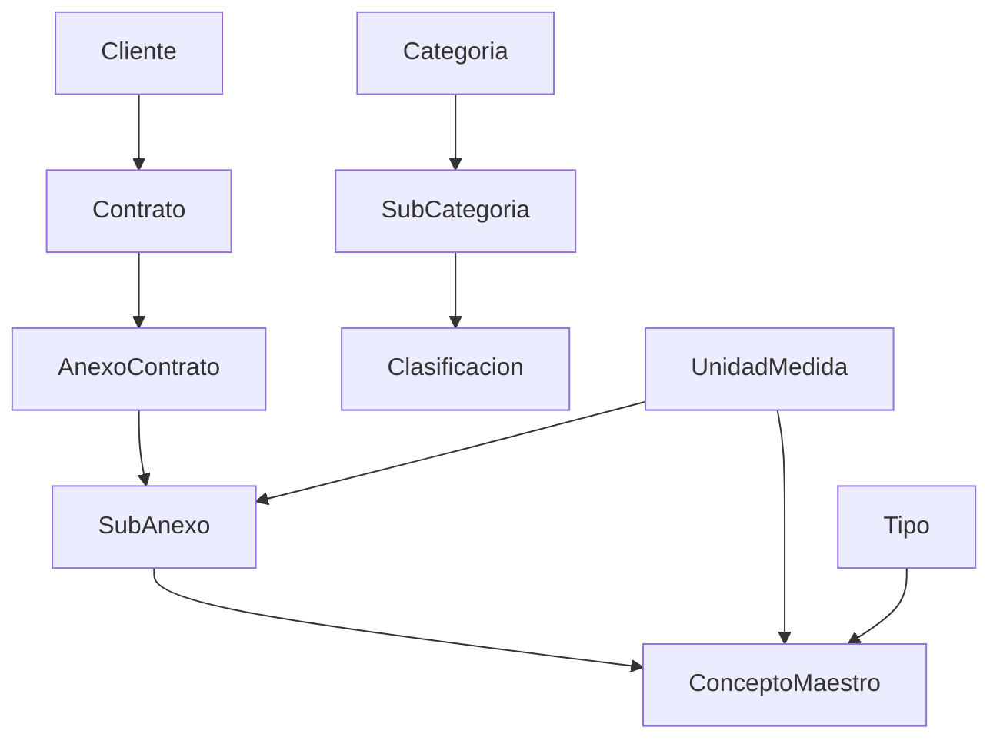

## Overview

The SASCOP BME SubTec application uses Django ORM with PostgreSQL. Models are organized into several categories:

- **Core Models** - Module system
- **Catalog Models** - Reference data and lookups
- **Contract Models** - Contract and annex management
- **PTE Models** - Project Task Entry management
- **OTE Models** - Work Order management
- **Production Models** - Production tracking and estimations
- **Activity Models** - User activity logging

## Core Models

### Modulo

The module system for managing application modules (`core/models.py:4-17`):

```python core/models.py
class Modulo(models.Model):
    """Sistema de módulos"""
    app_name = models.CharField(max_length=50, unique=True)
    nombre = models.CharField(max_length=100)
    descripcion = models.TextField()
    activo = models.BooleanField(default=True)
    orden = models.IntegerField(default=0)
    icono = models.CharField(max_length=50, default='apps')
    
    class Meta:
        db_table = 'core_modulo'
    
    def __str__(self):
        return self.nombre
```

**Fields:**
- `app_name` - Unique Django app name
- `nombre` - Display name
- `descripcion` - Module description
- `activo` - Active status
- `orden` - Display order
- `icono` - Icon identifier

## Catalog Models

Catalog entities for reference data (`operaciones/models/catalogos_models.py`):

### Tipo

Type classification for different entities:

```python operaciones/models/catalogos_models.py
class Tipo(models.Model):
    TIPO_CHOICES = [
        ('1', 'PTE'),
        ('2', 'OT'),
        ('3', 'PARTIDA'),
        ('4', 'PRODUCCION')
    ]
    
    descripcion = models.CharField(max_length=200)
    nivel_afectacion = models.IntegerField(choices=TIPO_CHOICES, default=0)
    comentario = models.TextField(blank=True, null=True)
    activo = models.BooleanField(default=True)

    class Meta:
        db_table = 'tipo'
```

### Frente

Work front classification:

```python operaciones/models/catalogos_models.py
class Frente(models.Model):
    descripcion = models.CharField(max_length=200)
    nivel_afectacion = models.IntegerField(blank=True, null=True)
    comentario = models.TextField(blank=True, null=True)
    activo = models.BooleanField(default=True)

    class Meta:
        db_table = 'frente'
```

### Estatus

Status tracking for different entity types:

```python operaciones/models/catalogos_models.py
class Estatus(models.Model):
    TIPO_AFECTACION = [
        ('1', 'PTE'),
        ('2', 'OT'),
        ('3', 'COBRO'),
        ('4', 'PASOS PTE'),
    ]
    descripcion = models.CharField(max_length=100)
    nivel_afectacion = models.IntegerField(choices=TIPO_AFECTACION, default=0)
    comentario = models.TextField(blank=True, null=True)
    activo = models.BooleanField(default=True)

    class Meta:
        db_table = 'cat_estatus'
```

### Sitio

Site/location management:

```python operaciones/models/catalogos_models.py
class Sitio(models.Model):
    descripcion = models.CharField(max_length=100)
    activo = models.BooleanField(default=True)
    id_frente = models.ForeignKey(Frente, on_delete=models.CASCADE, blank=True, null=True)
    comentario = models.TextField(blank=True, null=True)
    
    class Meta:
        db_table = 'sitio'
```

### UnidadMedida

Units of measure:

```python operaciones/models/catalogos_models.py
class UnidadMedida(models.Model):
    descripcion = models.CharField(max_length=50)
    clave = models.CharField(max_length=10)
    activo = models.BooleanField(default=True)
    comentario = models.TextField(blank=True, null=True)
    
    class Meta:
        db_table = 'unidad_medida'
```

### ResponsableProyecto

Project manager catalog:

```python operaciones/models/catalogos_models.py
class ResponsableProyecto(models.Model):
    descripcion = models.CharField(max_length=50)
    activo = models.BooleanField(default=True)
    comentario = models.TextField(blank=True, null=True)
    
    class Meta:
        db_table = 'responsable_proyecto'
```

### Cliente

Client management:

```python operaciones/models/catalogos_models.py
class Cliente(models.Model):
    descripcion = models.CharField(max_length=100)
    id_tipo = models.ForeignKey(Tipo, on_delete=models.CASCADE, blank=True, null=True)
    activo = models.BooleanField(default=True)
    comentario = models.TextField(blank=True, null=True)
    
    class Meta:
        db_table = 'cliente'
```

### Technical Categorization

**Categoria** - Technical categories:

```python operaciones/models/catalogos_models.py
class Categoria(models.Model):
    clave = models.CharField(max_length=20, null=True, blank=True)
    descripcion = models.CharField(max_length=600, null=True, blank=True)
    activo = models.BooleanField(default=True)

    class Meta:
        db_table = 'cat_categoria'
        verbose_name = 'Categoría Técnica'
```

**SubCategoria** - Subcategories:

```python operaciones/models/catalogos_models.py
class SubCategoria(models.Model):
    categoria = models.ForeignKey(Categoria, on_delete=models.CASCADE, related_name='subcategorias', null=True, blank=True)
    clave = models.CharField(max_length=20, null=True, blank=True)
    descripcion = models.CharField(max_length=600, null=True, blank=True)
    activo = models.BooleanField(default=True)

    class Meta:
        db_table = 'cat_subcategoria'
        unique_together = ['categoria', 'clave']
```

**Clasificacion** - Classifications:

```python operaciones/models/catalogos_models.py
class Clasificacion(models.Model):
    subcategoria = models.ForeignKey(SubCategoria, on_delete=models.CASCADE, related_name='clasificaciones', null=True, blank=True)
    clave = models.CharField(max_length=20, null=True, blank=True)
    descripcion = models.CharField(max_length=600, null=True, blank=True)
    activo = models.BooleanField(default=True)

    class Meta:
        db_table = 'cat_clasificacion'
        unique_together = ['subcategoria', 'clave']
```

## Contract Models

### Contrato

Contract management (`operaciones/models/catalogos_models.py:133-147`):

```python operaciones/models/catalogos_models.py
class Contrato(models.Model):
    numero_contrato = models.CharField(max_length=100, unique=True, verbose_name="No. Contrato", null=True, blank=True)
    descripcion = models.TextField(null=True, blank=True)
    cliente = models.ForeignKey(Cliente, on_delete=models.PROTECT, null=True, blank=True)
    fecha_inicio = models.DateField(null=True, blank=True)
    fecha_termino = models.DateField(null=True, blank=True)
    monto_mn = models.DecimalField(max_digits=20, decimal_places=2, default=0, null=True, blank=True)
    monto_usd = models.DecimalField(max_digits=20, decimal_places=2, default=0, null=True, blank=True)
    activo = models.BooleanField(default=True)

    class Meta:
        db_table = 'contrato'
```

### AnexoContrato

Contract annexes (`operaciones/models/catalogos_models.py:149-168`):

```python operaciones/models/catalogos_models.py
class AnexoContrato(models.Model):
    TIPO_ANEXO = [
        ('TECNICO', 'Anexo Técnico (Especificaciones)'),
        ('FINANCIERO', 'Anexo C (Lista de Precios)'),
        ('LEGAL', 'Legal/Administrativo'),
    ]
    
    contrato = models.ForeignKey(Contrato, on_delete=models.CASCADE, related_name='anexos_maestros')
    clave = models.CharField(max_length=100, null=True, blank=True)
    descripcion = models.CharField(max_length=100, null=True, blank=True)
    tipo = models.CharField(max_length=20, choices=TIPO_ANEXO, default='FINANCIERO')
    archivo = models.FileField(upload_to='contratos/anexos_maestros/', null=True, blank=True)
    monto_mn = models.DecimalField(max_digits=20, decimal_places=2, default=0, null=True, blank=True)
    monto_usd = models.DecimalField(max_digits=20, decimal_places=2, default=0, null=True, blank=True)
    activo = models.BooleanField(default=True)
    
    class Meta:
        db_table = 'contrato_anexo_maestro'
```

### SubAnexo

Sub-annexes with pricing (`operaciones/models/catalogos_models.py:170-187`):

```python operaciones/models/catalogos_models.py
class SubAnexo(models.Model):
    anexo_maestro = models.ForeignKey(AnexoContrato, on_delete=models.CASCADE, related_name='sub_anexos')
    clave_anexo = models.CharField(max_length=50)
    descripcion = models.TextField()
    unidad_medida = models.ForeignKey(UnidadMedida, on_delete=models.CASCADE, null=True, blank=True)
    cantidad = models.DecimalField(max_digits=20, decimal_places=2, default=0)
    precio_unitario_mn = models.DecimalField(max_digits=20, decimal_places=2, default=0)
    precio_unitario_usd = models.DecimalField(max_digits=20, decimal_places=2, default=0)
    importe_mn = models.DecimalField(max_digits=20, decimal_places=2, default=0)
    importe_usd = models.DecimalField(max_digits=20, decimal_places=2, default=0)
    activo = models.BooleanField(default=True)
    
    class Meta:
        db_table = 'contrato_sub_anexo'
        ordering = ['clave_anexo']
        unique_together = ['anexo_maestro', 'clave_anexo']
```

### ConceptoMaestro

Master concepts for contract items (`operaciones/models/catalogos_models.py:189-221`):

```python operaciones/models/catalogos_models.py
class ConceptoMaestro(models.Model):
    sub_anexo = models.ForeignKey(SubAnexo, on_delete=models.CASCADE, related_name='conceptos', null=True, blank=True)
    partida_ordinaria = models.CharField(max_length=50, null=True, blank=True)
    codigo_interno = models.CharField(max_length=50, blank=True, null=True)
    descripcion = models.TextField()
    unidad_medida = models.ForeignKey(UnidadMedida, on_delete=models.PROTECT)
    cantidad = models.DecimalField(max_digits=20, decimal_places=2, default=0)
    precio_unitario_mn = models.DecimalField(max_digits=18, decimal_places=2, default=0, null=True, blank=True)
    precio_unitario_usd = models.DecimalField(max_digits=18, decimal_places=2, default=0, null=True, blank=True)
    id_tipo_partida = models.ForeignKey(Tipo, on_delete=models.CASCADE, limit_choices_to={'nivel_afectacion': 3})
    categoria = models.TextField(null=True, blank=True)
    subcategoria = models.TextField(null=True, blank=True)
    clasificacion = models.TextField(null=True, blank=True)
    
    # PUE specific fields
    partida_extraordinaria = models.CharField(max_length=50, null=True, blank=True)
    pte_creacion = models.CharField(max_length=100, null=True, blank=True)
    ot_creacion = models.CharField(max_length=100, null=True, blank=True)
    fecha_autorizacion = models.DateField(null=True, blank=True)
    estatus = models.CharField(max_length=20, blank=True, null=True)
    comentario = models.TextField(blank=True, null=True)
    activo = models.BooleanField(default=True)

    class Meta:
        db_table = 'contrato_concepto_maestro'
        indexes = [
            models.Index(fields=['partida_ordinaria']),
            models.Index(fields=['sub_anexo']),
        ]
```

<Note>
The contract models support both MXN (Mexican Peso) and USD pricing throughout the system.
</Note>

## PTE Models

Project Task Entry models are defined in `operaciones/models/pte_models.py`:

- **PTEHeader** - PTE header information
- **PTEDetalle** - PTE step details
- **Paso** - Step definitions

## OTE Models

Work Order models are defined in `operaciones/models/ote_models.py`:

- **OTE** - Work order header
- **PasoOt** - Work order steps
- **OTDetalle** - Work order step details
- **ImportacionAnexo** - Annex import records
- **PartidaAnexoImportada** - Imported annex items
- **PartidaProyectada** - Projected items

## Production Models

Production tracking models are defined in `operaciones/models/produccion_models.py`:

- **Produccion** - Production records
- **Producto** - Product catalog
- **ReporteMensual** - Monthly reports
- **ReporteDiario** - Daily reports
- **EstimacionHeader** - Estimation headers
- **EstimacionDetalle** - Estimation details
- **CicloGuardia** - Guard cycles
- **Superintendente** - Superintendent records
- **RegistroGPU** - GPU tracking
- **CronogramaVersion** - Schedule versions
- **TareaCronograma** - Schedule tasks
- **AvanceCronograma** - Schedule progress
- **DependenciaTarea** - Task dependencies

## Activity Models

User activity tracking (`operaciones/models/registro_actividad_models.py`):

- **RegistroActividad** - Activity logging

## Model Relationships



## Querying Models

### Basic Queries

```python
from operaciones.models import Contrato, Cliente, ConceptoMaestro

# Get all active contracts
contratos = Contrato.objects.filter(activo=True)

# Get contracts by client
cliente = Cliente.objects.get(descripcion="PEMEX")
contratos_cliente = Contrato.objects.filter(cliente=cliente)

# Get master concepts with related data
conceptos = ConceptoMaestro.objects.select_related(
    'unidad_medida',
    'id_tipo_partida',
    'sub_anexo__anexo_maestro__contrato'
).filter(activo=True)
```

### Advanced Queries

```python
from django.db.models import Sum, Count

# Get total contract amounts
totales = Contrato.objects.aggregate(
    total_mn=Sum('monto_mn'),
    total_usd=Sum('monto_usd'),
    total_contratos=Count('id')
)

# Get concepts grouped by category
from django.db.models import Q

conceptos_por_categoria = ConceptoMaestro.objects.values(
    'categoria'
).annotate(
    cantidad_conceptos=Count('id'),
    total_cantidad=Sum('cantidad')
).order_by('-cantidad_conceptos')
```

## Database Migrations

Create migrations after model changes:

```bash
python manage.py makemigrations operaciones
python manage.py migrate operaciones
```

See [Database Migrations](/development/deployment/database-migrations) for more details.

## Model Admin

Register models in `admin.py` for Django admin interface:

```python
from django.contrib import admin
from .models import Contrato, Cliente, ConceptoMaestro

@admin.register(Contrato)
class ContratoAdmin(admin.ModelAdmin):
    list_display = ['numero_contrato', 'descripcion', 'cliente', 'activo']
    list_filter = ['activo', 'cliente']
    search_fields = ['numero_contrato', 'descripcion']
```

## Next Steps

<CardGroup cols={2}>
  <Card title="Utilities" icon="wrench" href="/development/utilities">
    Explore utility functions for working with models
  </Card>
  
  <Card title="Database Configuration" icon="database" href="/development/database-configuration">
    Learn about database setup and configuration
  </Card>
</CardGroup>