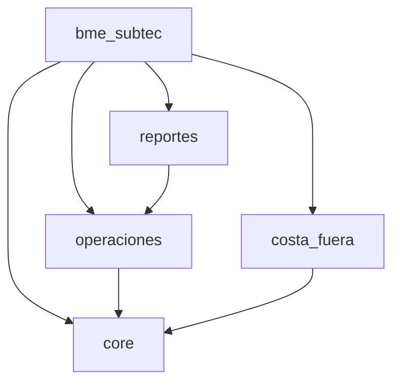

## Overview

SASCOP BME SubTec is a Django-based project organized into multiple Django apps, each serving specific business functions for operations management, reporting, and offshore activities.

## Root Directory Structure

```
bme_subtec/
├── bme_subtec/          # Main project configuration
├── operaciones/        # Core operations management app
├── core/               # Module system and shared utilities
├── costa_fuera/        # Offshore operations module
├── reportes/           # Reporting system
├── cronogramas/        # Schedule management
├── manage.py           # Django management script
├── requirements.txt    # Python dependencies
├── build_files.sh      # Build script for deployment
├── vercel.json         # Vercel deployment configuration
├── .env                # Environment variables (not in git)
├── .gitignore          # Git ignore rules
└── db.sqlite3          # SQLite database (development only)
```

## Project Configuration (bme_subtec/)

The main Django project configuration directory:

```
bme_subtec/
├── __init__.py
├── settings.py         # Main settings file
├── urls.py             # Root URL configuration
└── wsgi.py             # WSGI application entry point
```

### settings.py

The central configuration file (`bme_subtec/settings.py`):

**Key Settings:**

```python bme_subtec/settings.py
# Security
SECRET_KEY = os.getenv('SECRET_KEY', 'django-insecure-bme-subtec-default-key-change-in-production')
DEBUG = os.getenv('DEBUG', 'True') == 'True'

# Language and Timezone
LANGUAGE_CODE = 'es-mx'
TIME_ZONE = 'America/Mexico_City'
USE_I18N = True
USE_TZ = True
```

**Installed Apps:**

```python bme_subtec/settings.py
INSTALLED_APPS = [
    'django.contrib.admin',
    'django.contrib.auth',
    'django.contrib.contenttypes',
    'django.contrib.sessions',
    'django.contrib.messages',
    'django.contrib.staticfiles',
    'operaciones',      # Core operations
    'anymail',          # Email backend
    'core',             # Module system
    'costa_fuera',      # Offshore operations
    'reportes',         # Reports
]
```

**Middleware Stack:**

```python bme_subtec/settings.py
MIDDLEWARE = [
    'django.middleware.security.SecurityMiddleware',
    'whitenoise.middleware.WhiteNoiseMiddleware',  # Static files
    'django.contrib.sessions.middleware.SessionMiddleware',
    'django.middleware.common.CommonMiddleware',
    'django.middleware.csrf.CsrfViewMiddleware',
    'django.contrib.auth.middleware.AuthenticationMiddleware',
    'django.contrib.messages.middleware.MessageMiddleware',
    'django.middleware.clickjacking.XFrameOptionsMiddleware',
    'operaciones.middleware.SessionTimeoutMiddleware'  # Custom middleware
]
```

### urls.py

Root URL configuration (`bme_subtec/urls.py:7-20`):

```python bme_subtec/urls.py
urlpatterns = [
    path('admin/', admin.site.urls),
    path('', include('core.urls')),
    path('operaciones/', include('operaciones.urls')),
    path('accounts/login/', custom_login, name='login'),
    path('accounts/logout/', CustomLogoutView.as_view(next_page='/accounts/login/'), name='logout'),
]
```

### wsgi.py

WSGI application entry point (`bme_subtec/wsgi.py:1-8`):

```python bme_subtec/wsgi.py
import os
from django.core.wsgi import get_wsgi_application

os.environ.setdefault('DJANGO_SETTINGS_MODULE', 'bme_subtec.settings')

application = get_wsgi_application()
app = application
```

<Note>
The `app` variable is used by some deployment platforms like Vercel.
</Note>

## Core App (core/)

The core module system and shared utilities:

```
core/
├── __init__.py
├── admin.py
├── apps.py
├── models.py            # Module system models
├── urls.py
├── utils.py             # Utility functions
├── views/
│   ├── __init__.py
│   ├── dashboard.py     # Dashboard views
│   └── views.py
├── management/
│   └── commands/
│       ├── fn_enviar_reporte_semanal.py
│       └── inicializar_modulos.py
├── migrations/
└── tests.py
```

### Module Model

The core module system (`core/models.py:4-17`):

```python core/models.py
class Modulo(models.Model):
    """Sistema de módulos"""
    app_name = models.CharField(max_length=50, unique=True)
    nombre = models.CharField(max_length=100)
    descripcion = models.TextField()
    activo = models.BooleanField(default=True)
    orden = models.IntegerField(default=0)
    icono = models.CharField(max_length=50, default='apps')
    
    class Meta:
        db_table = 'core_modulo'
```

## Operations App (operaciones/)

The primary application for operations management:

```
operaciones/
├── __init__.py
├── admin.py
├── apps.py
├── middleware.py        # Session timeout middleware
├── registro_actividad.py
├── urls.py              # Operations URL routing
├── view.py
├── models/
│   ├── __init__.py
│   ├── catalogos_models.py      # Catalog entities
│   ├── pte_models.py            # PTE models
│   ├── ote_models.py            # OTE/Work Order models
│   ├── produccion_models.py     # Production tracking
│   └── registro_actividad_models.py  # Activity logging
├── views/                   # View functions
├── utils/                   # Utility functions
├── templates/
│   └── operaciones/         # HTML templates
├── static/
│   └── operaciones/
│       ├── css/
│       ├── js/
│       └── images/
├── anexos_ot/               # OT attachments
├── reports/
└── migrations/
```

### Models Organization

The operaciones app uses a modular model structure (`operaciones/models/__init__.py:1-13`):

```python operaciones/models/__init__.py
from .pte_models import PTEHeader, PTEDetalle, Paso
from .catalogos_models import Tipo, Frente, Estatus, Sitio, UnidadMedida, ResponsableProyecto, Cliente, Categoria, SubCategoria, Clasificacion, Contrato, AnexoContrato, SubAnexo, ConceptoMaestro
from .ote_models import OTE, PasoOt, OTDetalle, ImportacionAnexo, PartidaAnexoImportada, PartidaProyectada
from .produccion_models import Produccion, Producto, ReporteMensual, ReporteDiario, EstimacionHeader, EstimacionDetalle, CicloGuardia, Superintendente, RegistroGPU, CronogramaVersion, TareaCronograma, AvanceCronograma, DependenciaTarea
from .registro_actividad_models import RegistroActividad
```

See [Data Models](/development/data-models) for detailed model documentation.

## Costa Fuera App (costa_fuera/)

Offshore operations module:

```
costa_fuera/
├── __init__.py
├── admin.py
├── apps.py
├── models.py
├── views.py
├── urls.py
├── migrations/
└── templates/
```

<Note>
Currently commented out in URLs. Uncomment in `bme_subtec/urls.py` to enable.
</Note>

## Reportes App (reportes/)

Reporting and analytics module:

```
reportes/
├── __init__.py
├── admin.py
├── apps.py
├── models.py
├── views.py
├── urls.py
├── migrations/
└── templates/
```

<Note>
Currently commented out in URLs. Uncomment in `bme_subtec/urls.py` to enable.
</Note>

## Static Files Structure

Static files are organized per app:

```
operaciones/static/operaciones/
├── css/
│   ├── styles.css
│   └── dashboard.css
├── js/
│   ├── main.js
│   └── charts.js
└── images/
    ├── logo_black_white_subtec.jpg
    └── SASCOP_LOGO.png
```

**Static Files Configuration:**

```python bme_subtec/settings.py
STATIC_URL = '/static/'
STATIC_ROOT = BASE_DIR / 'staticfiles'
STATICFILES_DIRS = [
    BASE_DIR / 'operaciones' / 'static',
]
```

## Templates Structure

Templates are configured for the operaciones app:

```python bme_subtec/settings.py
TEMPLATES = [
    {
        'BACKEND': 'django.template.backends.django.DjangoTemplates',
        'DIRS': [BASE_DIR / 'operaciones' / 'templates'],
        'APP_DIRS': True,
        'OPTIONS': {
            'context_processors': [
                'django.template.context_processors.debug',
                'django.template.context_processors.request',
                'django.contrib.auth.context_processors.auth',
                'django.contrib.messages.context_processors.messages',
            ],
        },
    },
]
```

## Data Import Scripts

Utility scripts for data import:

```
├── importar_excel.py       # Excel import utility
├── importar_ot.py          # Work order import
└── crear_detalles_ptes.py  # PTE details creation
```

## Sample Data Files

Example data files for import:

```
├── ANEXO_C_CONTRATO.xlsx
├── ANEXO_C_PUES.xlsx
├── OT_IMPORTAR.xlsx
└── PRODUCTOS_IMPORTAR.xlsx
```

## Configuration Files

### requirements.txt

Python dependencies organized by category:

**Core Framework:**
- Django==4.2.7
- asgiref==3.9.2
- gunicorn==21.2.0

**Database:**
- psycopg2-binary==2.9.7

**Static Files:**
- whitenoise==6.4.0

**Data Processing:**
- pandas==2.3.3
- numpy==2.3.3
- openpyxl==3.1.5
- XlsxWriter==3.1.2

**PDF Generation:**
- reportlab==4.0.4
- PyPDF2==3.0.1

**Charts & Visualization:**
- matplotlib==3.10.8
- scipy==1.17.0

**Email:**
- django-anymail==14.0

**Utilities:**
- python-dotenv==1.0.0
- beautifulsoup4==4.12.2
- lxml==4.9.3
- qrcode==7.4.2

### .gitignore

Version control exclusions (``.gitignore``):

```gitignore
__pycache__/
*.pyc
*.pyo
*.pyd
venv/
.env
media/
staticfiles/
global-bundle.pem
*.pem
*.key
*.cert
ssl/
certificates/
backups_bd.py
```

## Deployment Files

### build_files.sh

Build script for deployment (currently empty but reserved for build steps).

### vercel.json

Vercel deployment configuration (currently empty but reserved for Vercel-specific settings).

## Database Tables

Key database tables:

**Core:**
- `core_modulo` - Module system

**Catalogs:**
- `tipo` - Types
- `frente` - Fronts
- `cat_estatus` - Status catalog
- `sitio` - Sites
- `unidad_medida` - Units of measure
- `responsable_proyecto` - Project managers
- `cliente` - Clients
- `cat_categoria` - Categories
- `cat_subcategoria` - Subcategories
- `cat_clasificacion` - Classifications

**Contracts:**
- `contrato` - Contracts
- `contrato_anexo_maestro` - Contract annexes
- `contrato_sub_anexo` - Sub-annexes
- `contrato_concepto_maestro` - Master concepts

**Operations:**
- `pte_header` - PTE headers
- `pte_detalle` - PTE details
- `ot` - Work orders
- `ot_detalle` - Work order details

**Production:**
- `produccion` - Production records
- `producto` - Products
- `reporte_mensual` - Monthly reports
- `reporte_diario` - Daily reports
- `estimacion_header` - Estimation headers
- `estimacion_detalle` - Estimation details

## App Dependencies



## Code Organization Best Practices

<Steps>
  <Step title="Models">
    Keep models organized in separate files by domain:
    - `catalogos_models.py` for catalogs
    - `pte_models.py` for PTEs
    - `ote_models.py` for work orders
    - `produccion_models.py` for production
  </Step>

  <Step title="Views">
    Organize views by functionality in the `views/` directory.
  </Step>

  <Step title="Utilities">
    Place shared utility functions in:
    - `core/utils.py` for cross-app utilities
    - `operaciones/utils/` for app-specific utilities
  </Step>

  <Step title="Templates">
    Follow Django template hierarchy:
    ```
    templates/
    ├── base.html
    └── operaciones/
        ├── base_operaciones.html
        ├── pte_list.html
        └── ot_list.html
    ```
  </Step>

  <Step title="Static Files">
    Keep static files organized by type:
    ```
    static/operaciones/
    ├── css/
    ├── js/
    └── images/
    ```
  </Step>
</Steps>

## Next Steps

<CardGroup cols={2}>
  <Card title="Data Models" icon="diagram-project" href="/development/data-models">
    Explore the complete data model structure
  </Card>
  
  <Card title="Middleware" icon="layer-group" href="/development/middleware">
    Learn about custom middleware components
  </Card>
</CardGroup>