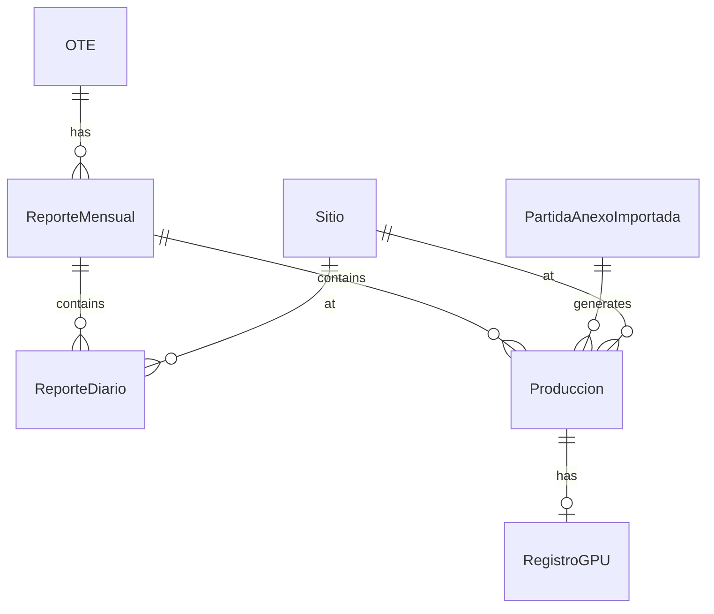

## Introduction

The Production Tracking module is the core operational management system in SASCOP BME SubTec. It enables real-time tracking of production volumes, daily operational status, GPU (Generadores de Precio Unitario) evidence management, and project schedule synchronization.

<Warning>
  Production data directly impacts billing estimations. Always verify volumes before closing monthly reports.
</Warning>

## System Architecture

The production tracking system is organized around a hierarchical data structure:

<Steps>
  <Step title="Monthly Report (ReporteMensual)">
    Container for all production activities in a specific month for a work order
  </Step>
  <Step title="Daily Reports (ReporteDiario)">
    Daily operational status tracking (Productive, Non-productive, Standby)
  </Step>
  <Step title="Production Records (Produccion)">
    Volume-based production entries linked to budget line items
  </Step>
  <Step title="GPU Registry (RegistroGPU)">
    Photographic evidence and administrative tracking for specific annexes (C-2, C-3)
  </Step>
</Steps>

## Core Data Models

### ReporteMensual Model

Represents the monthly folder containing all production and operational data.

<CodeGroup>
```python produccion_models.py:22-43
class ReporteMensual(models.Model):
    """
    Representa la 'Carpeta Mensual' de una OT.
    Agrupa todos los reportes diarios y de producción de un mes específico.
    """
    id_ot = models.ForeignKey(OTE, on_delete=models.CASCADE, related_name='reportes_mensuales', blank=True, null=True)
    mes = models.IntegerField(help_text="Mes numérico (1-12)")
    anio = models.IntegerField(help_text="Año (Ej. 2025)")
    archivo = models.URLField(blank=True, null=True, verbose_name="Link Evidencia (Drive)")
    id_estatus = models.ForeignKey(Estatus, on_delete=models.CASCADE, limit_choices_to={'nivel_afectacion': 5}, default=1, verbose_name="Estatus Cierre")
    fecha_creacion = models.DateTimeField(auto_now_add=True)
    fecha_actualizacion = models.DateTimeField(auto_now=True)

    class Meta:
        db_table = 'reporte_mensual_header'
        unique_together = ['id_ot', 'mes', 'anio']
        verbose_name = "Reporte Mensual"
        verbose_name_plural = "Reportes Mensuales"

    def __str__(self):
        return f"Reporte {self.id_ot.orden_trabajo} - {self.mes}/{self.anio}"
```
</CodeGroup>

<Info>
  **Key Features:**
  - Unique constraint ensures one monthly report per OT per month
  - Stores Google Drive link for consolidated evidence
  - Tracks closure status for monthly closeout process
</Info>

### ReporteDiario Model

Controls the operational status for each day within a monthly report.

<CodeGroup>
```python produccion_models.py:44-62
class ReporteDiario(models.Model):
    """
    Controla el estatus operativo del día para una OT.
    Alimenta el Grid de Asistencia.
    """
    id_reporte_mensual = models.ForeignKey(ReporteMensual, on_delete=models.CASCADE, related_name='dias_estatus', blank=True, null=True)
    fecha = models.DateField()
    id_estatus = models.ForeignKey(Estatus, on_delete=models.CASCADE, limit_choices_to={'nivel_afectacion': 6}, default=1, verbose_name="Estatus Operativo")
    comentario = models.CharField(max_length=255, blank=True, null=True, help_text="Observación breve del día")
    bloqueado = models.BooleanField(default=False)
    id_sitio = models.ForeignKey(Sitio, on_delete=models.CASCADE, null=True, blank=True)
    
    class Meta:
        db_table = 'reporte_diario_detalle'
        unique_together = ['id_reporte_mensual', 'fecha', 'id_sitio']
        indexes = [models.Index(fields=['fecha'])]

    def __str__(self):
        return f"{self.fecha} - {self.id_estatus}"
```
</CodeGroup>

<Tip>
  The `bloqueado` field prevents modification of closed days, ensuring data integrity for auditing.
</Tip>

### Produccion Model

Records actual production volumes for budget line items.

<CodeGroup>
```python produccion_models.py:63-88
class Produccion(models.Model):
    TIPO_TIEMPO_CHOICES = [
        ('TE', 'Tiempo Efectivo'),
        ('CMA', 'Costo Mínimo Aplicado'),
    ]
    id_partida_anexo = models.ForeignKey(PartidaAnexoImportada, on_delete=models.PROTECT, related_name='registros_produccion', blank=True, null=True)
    id_reporte_mensual = models.ForeignKey(ReporteMensual, on_delete=models.CASCADE, related_name='producciones', blank=True, null=True)
    fecha_produccion = models.DateField()
    volumen_produccion = models.DecimalField(max_digits=15, decimal_places=6)
    tipo_tiempo = models.CharField(max_length=3, choices=TIPO_TIEMPO_CHOICES, blank=True, null=True)
    es_excedente = models.BooleanField(default=False)
    id_estatus_cobro = models.ForeignKey(Estatus, on_delete=models.CASCADE, limit_choices_to={'nivel_afectacion': 3})
    comentario = models.TextField(blank=True)
    id_sitio_produccion = models.ForeignKey(Sitio, on_delete=models.SET_NULL, null=True, blank=True)

    class Meta:
        db_table = 'produccion'
        unique_together = ['id_partida_anexo', 'fecha_produccion', 'tipo_tiempo', 'id_sitio_produccion']
        indexes = [
            models.Index(fields=['fecha_produccion']),
            models.Index(fields=['id_partida_anexo']),
            models.Index(fields=['tipo_tiempo'])
        ]

    def __str__(self):
        return f"Producción {self.id} - OT {self.id_ot.orden_trabajo} - {self.fecha_produccion}"
```
</CodeGroup>

<Info>
  **Production Type Classification:**
  - **TE (Tiempo Efectivo)**: Production during regular working hours
  - **CMA (Costo Mínimo Aplicado)**: Production during minimum cost periods (downtime with guaranteed payment)
</Info>

### RegistroGPU Model

Manages photographic evidence and administrative tracking for C-2 and C-3 annexes.

<CodeGroup>
```python produccion_models.py:90-104
class RegistroGPU(models.Model):
    """
    pro_registro_gpu (Espejo Administrativo y Evidencias).
    Solo se crea para C-2 y C-3.
    """
    id_produccion = models.OneToOneField(Produccion, on_delete=models.CASCADE, related_name='gpu')
    id_estatus = models.ForeignKey(Estatus, on_delete=models.CASCADE, limit_choices_to={'nivel_afectacion': 6}, verbose_name="Estatus GPU")
    archivo = models.URLField(max_length=500, blank=True, null=True, verbose_name="Link Evidencia Fotográfica")
    nota_bloqueo = models.TextField(blank=True, verbose_name="Observaciones", null=True)
    id_estimacion_detalle = models.ForeignKey('EstimacionDetalle', on_delete=models.SET_NULL, null=True, blank=True)
    fecha_actualizacion = models.DateTimeField(auto_now=True)

    class Meta:
        db_table = 'registro_generadores_pu'
```
</CodeGroup>

<Warning>
  GPU registries are automatically created only for specific annexes: C-2, C-3, C2EXT, C3EXT
</Warning>

## Production Workflow

<Steps>
  <Step title="Select Site and Month">
    Navigate to production tracking and select the operational site and target month
  </Step>
  <Step title="Record Daily Status">
    Mark each day as Productive, Non-productive, or Standby in the daily report grid
  </Step>
  <Step title="Enter Production Volumes">
    Record actual volumes per budget line item in the production grid
  </Step>
  <Step title="Upload GPU Evidence">
    For C-2/C-3 annexes, upload photographic evidence to Drive and link URLs
  </Step>
  <Step title="Close Monthly Report">
    Review totals, attach consolidated evidence, and mark monthly report as closed
  </Step>
</Steps>

## Key Features

<CardGroup cols={2}>
  <Card title="Multi-Site Tracking" icon="layer-group">
    Track production across multiple operational sites (platforms, vessels, yards)
  </Card>
  <Card title="Excess Detection" icon="exclamation-triangle">
    Automatic flagging when cumulative production exceeds authorized volumes
  </Card>
  <Card title="Time Classification" icon="clock">
    Separate tracking for Effective Time (TE) and Minimum Cost Applied (CMA)
  </Card>
  <Card title="Financial Integration" icon="dollar-sign">
    Production data feeds directly into billing estimation modules
  </Card>
</CardGroup>

## API Endpoints

Production tracking exposes several REST endpoints for data operations:

<AccordionGroup>
  <Accordion title="GET /produccion/obtener_sitios_con_ots_ejecutadas/">
    Returns all sites with active work orders in execution status.
    
    **Response:**
    ```json
    [
      {"id": 1, "descripcion": "PLATFORM ABC-1"},
      {"id": 2, "descripcion": "VESSEL XYZ-2"}
    ]
    ```
  </Accordion>
  
  <Accordion title="GET /produccion/ots_por_sitio_grid/">
    Returns work orders for a specific site with daily status data for the grid.
    
    **Parameters:**
    - `id_sitio`: Site ID
    - `mes`: Month (1-12)
    - `anio`: Year (e.g., 2025)
    
    **Response includes:**
    - Work order details
    - Daily status matrix (31 columns)
    - Blocked days based on OT validity
  </Accordion>
  
  <Accordion title="POST /produccion/guardar_reportes_diarios_masiva/">
    Bulk saves daily reports for multiple work orders.
    
    **Payload:**
    ```json
    {
      "reportes": [
        {"id_ot": 123, "valores": ["Productivo", "Productivo", null, ...]}
      ],
      "mes": 3,
      "anio": 2025,
      "id_sitio": 5
    }
    ```
  </Accordion>
  
  <Accordion title="GET /produccion/obtener_partidas_produccion/">
    Returns consolidated budget line items with production data for the grid.
    
    **Parameters:**
    - `id_ot`: Work order ID
    - `mes`: Month
    - `anio`: Year
    - `tipo_tiempo`: 'TE' or 'CMA'
    - `id_sitio`: Site ID
    
    **Features:**
    - Consolidates volumes across OT family (initial + reprogramming)
    - Groups by annex with subtotals
    - Calculates excess flags
    - Returns financial totals (MXN, USD)
  </Accordion>
  
  <Accordion title="POST /produccion/guardar_produccion_masiva/">
    Bulk saves production volumes for multiple line items.
    
    **Features:**
    - Automatic GPU registry creation for C-2/C-3 annexes
    - Running total calculation for excess detection
    - Respects blocked days
  </Accordion>
</AccordionGroup>

## Database Relationships



## Next Steps

<CardGroup cols={2}>
  <Card title="Daily Reports" icon="calendar-check" href="/features/production/daily-reports">
    Learn how to manage daily operational status tracking
  </Card>
  <Card title="Monthly Reports" icon="folder" href="/features/production/monthly-reports">
    Understand monthly report consolidation and closure
  </Card>
  <Card title="GPU Management" icon="image" href="/features/production/gpu-management">
    Manage photographic evidence for pricing generators
  </Card>
  <Card title="Schedule Tracking" icon="gantt" href="/features/production/schedule-tracking">
    Import and track Microsoft Project schedules
  </Card>
</CardGroup>