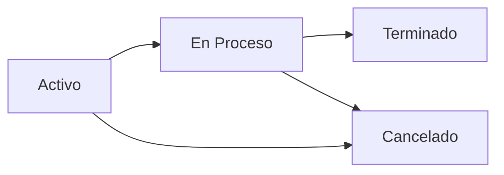

## Introduction

The PTE (Proyectos de Trabajo Especial) module is a core component of SASCOP BME SubTec that manages special work projects from initial request through completion. PTEs represent work orders that go through a defined workflow with multiple status stages and detailed step tracking.

<Info>
PTEs serve as the foundation for creating OTEs (Órdenes de Trabajo Especial) once all workflow steps are completed.
</Info>

## Core Components

### PTEHeader Model

The `PTEHeader` model represents the main PTE record and contains essential project information:

```python
class PTEHeader(models.Model):
    ESTATUS_CHOICES = [
        (1, 'Activo'),
        (2, 'En Proceso'),
        (3, 'Terminado'),
        (4, 'Cancelado'),
    ]
    
    id_tipo = models.ForeignKey(Tipo, on_delete=models.CASCADE, limit_choices_to={'nivel_afectacion': 1})
    oficio_pte = models.CharField(max_length=100)
    oficio_solicitud = models.CharField(max_length=100)
    descripcion_trabajo = models.TextField()
    fecha_solicitud = models.DateField(blank=True, null=True)
    fecha_entrega = models.DateField(blank=True, null=True)
    plazo_dias = models.FloatField()
    id_orden_trabajo = models.CharField(max_length=100, blank=True, null=True)
    id_responsable_proyecto = models.ForeignKey(ResponsableProyecto, on_delete=models.CASCADE, blank=True, null=True)
    total_homologado = models.DecimalField(max_digits=15, decimal_places=2, default=0)
    estatus = models.IntegerField(choices=ESTATUS_CHOICES, default=1)
    prioridad = models.IntegerField(blank=True, null=True)
    id_cliente = models.ForeignKey(Cliente, on_delete=models.CASCADE, blank=True, null=True)
    comentario = models.TextField(blank=True, null=True)
```

<Note>
The `estatus` field uses integer choices to track the PTE lifecycle, while `fecha_entrega` is automatically set when the status changes to "Terminado" (3).
</Note>

### PTEDetalle Model

Each PTE contains multiple detail records tracking individual workflow steps:

```python
class PTEDetalle(models.Model):
    id_pte_header = models.ForeignKey(PTEHeader, on_delete=models.CASCADE, related_name='detalles')
    estatus_paso = models.ForeignKey(Estatus, on_delete=models.CASCADE, limit_choices_to={'nivel_afectacion': 4})
    id_paso = models.ForeignKey(Paso, on_delete=models.CASCADE)
    fecha_entrega = models.DateField(null=True, blank=True)
    fecha_inicio = models.DateField(null=True, blank=True)
    fecha_termino = models.DateField(null=True, blank=True)
    comentario = models.TextField(blank=True, null=True)
    archivo = models.TextField(blank=True, null=True)
```

### Paso Model

Workflow steps are defined in the `Paso` model with ordering and type classification:

```python
class Paso(models.Model):
    descripcion = models.CharField(max_length=200)
    orden = models.CharField(blank=True, null=True, max_length=10)
    activo = models.BooleanField(default=True)
    importancia = models.FloatField(default=0)
    tipo = models.IntegerField(blank=True, null=True, default=1)
    comentario = models.TextField(blank=True, null=True)
    id_tipo_cliente = models.ForeignKey(Tipo, on_delete=models.CASCADE, null=True, blank=True)
```

## Key Features

<CardGroup cols={2}>
  <Card title="Status Tracking" icon="chart-line">
    Track PTEs through four distinct statuses: Activo, En Proceso, Terminado, and Cancelado
  </Card>
  
  <Card title="Step Management" icon="list-check">
    Manage detailed workflow steps with individual status tracking and progress calculation
  </Card>
  
  <Card title="Client-Based Workflows" icon="users">
    Automatically assign workflow steps based on client type for customized processes
  </Card>
  
  <Card title="OT Generation" icon="file-export">
    Convert completed PTEs into OTs (Órdenes de Trabajo) with automated data transfer
  </Card>
</CardGroup>

## Status Flow



<Steps>
  <Step title="Activo">
    PTE has been created and is ready to begin
  </Step>
  
  <Step title="En Proceso">
    Work is actively being performed on the PTE
  </Step>
  
  <Step title="Terminado">
    All steps completed, PTE is ready for OT generation
  </Step>
  
  <Step title="Cancelado">
    PTE has been cancelled and will not proceed
  </Step>
</Steps>

## URL Endpoints

The PTE module provides the following key endpoints:

| Endpoint | View Function | Purpose |
|----------|--------------|----------|
| `/pte/` | `lista_pte` | List all PTEs |
| `/pte/<id>/` | `detalle_pte` | View PTE details |
| `/pte/crear/` | `crear_pte` | Create new PTE |
| `/pte/editar/` | `editar_pte` | Edit existing PTE |
| `/pte/eliminar/` | `eliminar_pte` | Logical deletion |
| `/pte/datatable/` | `datatable_ptes` | DataTables JSON |
| `/pte/cambiar_estatus_pte/` | `cambiar_estatus_pte` | Update PTE status |
| `/pte/cambiar_estatus_paso/` | `cambiar_estatus_paso` | Update step status |

<Warning>
The `eliminar_pte` function performs a **logical deletion** by setting `estatus=0`, not a physical database deletion. This preserves historical data.
</Warning>

## Progress Calculation

PTE progress is calculated based on completed steps:

```python
detalles = PTEDetalle.objects.filter(id_pte_header_id=pte_id)
total_pasos = detalles.count()
pasos_completados = detalles.filter(estatus_paso__in=[3, 14]).count()

progreso = 0
if total_pasos > 0:
    progreso = (pasos_completados / total_pasos) * 100
```

<Tip>
Steps with status `3` (Completado) or `14` (No Aplica) are both counted as completed for progress calculation.
</Tip>

## Next Steps

<CardGroup cols={2}>
  <Card title="Creating PTEs" icon="plus" href="/features/pte/creating-pte">
    Learn how to create and configure new PTEs
  </Card>
  
  <Card title="Workflow Steps" icon="route" href="/features/pte/workflow-steps">
    Understand the detailed workflow step management
  </Card>
  
  <Card title="Status Tracking" icon="signal" href="/features/pte/status-tracking">
    Master PTE and step status tracking
  </Card>
</CardGroup>